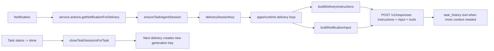

# Task-Scoped History, System Instructions, and Session Isolation Plan

## 1. Context & goal

We want three guarantees in runtime delivery: (a) the agent should act only on current-task context, (b) context pollution across tasks should be minimized with one persistent OpenClaw session per `(task, agent)` while active and a new generation after reopen, and (c) operational guidance should move from a giant inline user prompt to a clearer system-instruction layer. We also want an explicit `task_history` tool so agents load context from backend data (messages + activities) instead of relying on large injected blobs.

Key constraints:

- Keep current runtime and Convex architecture (notification-driven delivery).
- Maintain backward compatibility for non-task notifications and existing agent sessions.
- Keep local `/agent/*` fallback endpoints working with new session keys.
- Avoid cross-account leakage and preserve tenant isolation.
- Keep prompts deterministic and auditable (versioned instruction contract).

### Explicit scope decisions (already confirmed)

- Session granularity: one persistent session per `(task, agent)` while task is active.
- Reopen behavior: reopening a completed task creates a new session generation (`v2`, `v3`, ...), never reuses a closed generation.
- Non-task notifications (heartbeat/system): keep using base `agents.sessionKey`.
- Instructions persistence model: OpenResponses `instructions` are request-level, so resend deterministic instructions on every turn.

### Success criteria (must all be true before merge)

- A junior engineer can run one task with two agents and observe different task-scoped session keys for each agent-task pair.
- The same agent on two different tasks uses different session keys and does not reference unrelated task history in replies.
- After task transitions to `done`, sessions for that task are marked closed; after reopen, next delivery uses a fresh generation key.
- Runtime sends OpenResponses `instructions` + compact `input`; the old giant instruction blob is no longer the only policy source.
- `task_history` tool returns task snapshot + message history + activity history with account-safe validation.
- Existing non-task flows and `/agent/*` endpoints remain functional.
- Orchestrator chat continues to work as coordination-only with no behavior regressions.

### Non-goals (to avoid scope creep)

- Do not remove or migrate away `agents.sessionKey` in this refactor.
- Do not redesign OpenClaw profile sync or heartbeat architecture.
- Do not change task workflow semantics (status transitions/permissions) beyond session close hooks on `done`.
- Do not introduce cross-account/global history tools.
- Do not alter orchestrator role permissions or orchestrator-chat product semantics.

## 2. Codebase research summary

Main files inspected:

- [apps/runtime/src/delivery/prompt.ts](apps/runtime/src/delivery/prompt.ts)
- [apps/runtime/src/delivery.ts](apps/runtime/src/delivery.ts)
- [apps/runtime/src/delivery/types.ts](apps/runtime/src/delivery/types.ts)
- [apps/runtime/src/gateway.ts](apps/runtime/src/gateway.ts)
- [apps/runtime/src/health.ts](apps/runtime/src/health.ts)
- [apps/runtime/src/agent-sync.ts](apps/runtime/src/agent-sync.ts)
- [packages/backend/convex/service/notifications.ts](packages/backend/convex/service/notifications.ts)
- [packages/backend/convex/service/actions.ts](packages/backend/convex/service/actions.ts)
- [packages/backend/convex/schema.ts](packages/backend/convex/schema.ts)
- [packages/backend/convex/agents.ts](packages/backend/convex/agents.ts)
- [packages/backend/convex/tasks.ts](packages/backend/convex/tasks.ts)
- [packages/backend/convex/service/tasks.ts](packages/backend/convex/service/tasks.ts)
- [apps/runtime/src/tooling/agentTools.ts](apps/runtime/src/tooling/agentTools.ts)
- [packages/backend/convex/service/messages.ts](packages/backend/convex/service/messages.ts)
- [packages/backend/convex/activities.ts](packages/backend/convex/activities.ts)
- [apps/runtime/src/delivery.test.ts](apps/runtime/src/delivery.test.ts)

What is already good:

- Prompt has explicit scoping directives: "Respond only to this notification" and "Use only the thread history shown above for this task".
- Delivery thread context is fetched by `notification.taskId` and injected as `THREAD HISTORY`.
- Cross-task overview is already gated to orchestrator chat only.
- Runtime already has a `task_load` tool path that can be extended/reused for tool-first context loading.
- OpenClaw OpenResponses supports `instructions` merged into system prompt.

Gaps found:

- Hard isolation is mostly instruction-level; current tests do not explicitly lock these scope rules.
- In `getForDelivery`, thread query uses `taskId` index only; add stronger account/task consistency checks.
- Session model is currently global per agent (`agent:{slug}:{accountId}`), not per `(task,agent)`.
- Delivery guidance is mostly embedded in one large user-prompt body, which is harder to reason about and version.
- No single tool returns both task message history and activity history together.

## 3. High-level design

Introduce three aligned layers: task-scoped session routing, system-instruction contract via OpenResponses `instructions`, and tool-first history retrieval.

- Keep `agents.sessionKey` as the base/legacy session (for non-task notifications, heartbeat, and compatibility).
- Add a new backend table for task-scoped sessions per `(accountId, taskId, agentId)` with generation (`v1`, `v2`, ...).
- Resolve `deliverySessionKey` in `service.actions.getNotificationForDelivery`:
  - If notification has task + agent: return active task session key (create if missing).
  - If last task session was closed (task previously done): create next generation key.
  - If no task: fall back to legacy `agent.sessionKey`.
- Add a versioned `deliveryInstructionProfile` generated from runtime policy + capabilities and send it via OpenResponses `instructions` on each turn for that session.
- Keep user `input` focused on notification payload + compact current task context; move policy-heavy guidance into the `instructions` layer.
- Add a new `task_history` tool returning current task snapshot + message history + activity history in one call; keep `task_load` for compatibility (either delegate internally or evolve to same backend payload).
- On status transition to `done`, close active task sessions for that task.
- On reopen, no eager mutation required; next delivery lazily creates new generation (as requested: new session on reopen).
- Preserve orchestrator-chat special handling (`orchestratorChatTaskId` gates account-level context, orchestrator-only coordination behavior, and orchestrator subscription semantics).

### Data contracts for implementation

- Delivery context extension:
  - `deliverySessionKey?: string`
  - `deliveryInstructionProfileVersion?: string` (for observability/regression debugging)
- OpenResponses send payload extension:
  - `instructions?: string`
  - `input: string | item[]` (compact notification body + minimal structured context)
- New tool schema:
  - `task_history(taskId: string, messageLimit?: number, activityLimit?: number)`
  - Availability: all agents with task context (not orchestrator-only).
  - Defaults/caps: `messageLimit` default `25`, max `200`; `activityLimit` default `30`, max `200`.
  - Return shape:
    - `task`: core task metadata
    - `messages`: recent thread messages (oldest -> newest)
    - `activities`: recent task-targeted activities (newest -> oldest acceptable if documented)
    - `meta`: `{ messageLimitApplied, activityLimitApplied }`

## 4. File & module changes

### Backend schema and session lifecycle

- [packages/backend/convex/schema.ts](packages/backend/convex/schema.ts)
  - Add `agentTaskSessions` table.
  - Suggested fields: `accountId`, `taskId`, `agentId`, `agentSlug`, `generation`, `sessionKey`, `openedAt`, `closedAt`, `closedReason`.
  - Add indexes for:
    - active lookup by `(accountId, taskId, agentId, closedAt)`
    - lookup by `sessionKey` (for validation/diagnostics)
    - task-wide active session closure.
  - Add message index `by_account_task_created` to harden thread query scoping.
- [packages/backend/convex/service/notifications.ts](packages/backend/convex/service/notifications.ts)
  - Harden `getForDelivery`:
    - Validate `task.accountId === notification.accountId` when task exists.
    - Validate `message.accountId === notification.accountId` when message exists.
    - Fetch thread via account+task composite index (or defensive post-filter) to guarantee tenant+task scoping.
  - Keep orchestrator context gating unchanged, but trim injected thread payload (tool-first approach).
  - Keep `shouldIncludeOrchestratorContext` behavior unchanged for `orchestratorChatTaskId`.
- [packages/backend/convex/service/actions.ts](packages/backend/convex/service/actions.ts)
  - Extend `getNotificationForDelivery` to resolve and return `deliverySessionKey`.
  - Wire to new internal mutation/query for task-scoped session resolution.
  - Add `getTaskHistoryForAgentTool` action (service auth + account/agent/task checks).
- [packages/backend/convex/service/messages.ts](packages/backend/convex/service/messages.ts)
  - Ensure tool query path for thread remains account-safe and reusable by `task_history`.
- [packages/backend/convex/service/activities.ts](packages/backend/convex/service/activities.ts) (new)
  - Add internal query to list task-scoped activities for tools (`targetType=task`, `targetId=taskId`, bounded limit, account-validated).
- [packages/backend/convex/service/tasks.ts](packages/backend/convex/service/tasks.ts)
  - In `updateStatusFromAgent`, when transitioning to `done`, close active `agentTaskSessions` for the task.
- [packages/backend/convex/tasks.ts](packages/backend/convex/tasks.ts)
  - In user-driven `updateStatus`, when transitioning to `done`, close active `agentTaskSessions` for the task.
  - Keep `reopen` behavior; new session generation should happen lazily on next delivery.

### Runtime delivery/session usage

- [apps/runtime/src/delivery/types.ts](apps/runtime/src/delivery/types.ts)
  - Add optional `deliverySessionKey` on `DeliveryContext`.
- [apps/runtime/src/delivery/prompt.ts](apps/runtime/src/delivery/prompt.ts)
  - Split into:
    - `buildDeliveryInstructions(...)` for policy/system guidance.
    - `buildNotificationInput(...)` for current notification/task payload.
  - Keep strict current-task scope constraints in instructions.
  - Preserve orchestrator-chat-specific instruction blocks (coordination-only + required response_request/review flow).
- [apps/runtime/src/delivery.ts](apps/runtime/src/delivery.ts)
  - Use `deliverySessionKey ?? agent.sessionKey` for:
    - `sendToOpenClaw`
    - `sendOpenClawToolResults`
  - Send `instructions` (system contract) and compact `input` separately.
  - Ensure gateway session registry includes resolved task-scoped keys before sending.
- [apps/runtime/src/gateway.ts](apps/runtime/src/gateway.ts)
  - Support registering many session keys per agent (task-scoped keys).
  - Update remove-by-agent helper to remove all keys for the agent, not first match only.
  - Keep `resolveAgentIdFromSessionKey` compatible with new key format.
  - Extend send payload options to pass `instructions` through OpenResponses.
- [apps/runtime/src/health.ts](apps/runtime/src/health.ts)
  - Keep `x-openclaw-session-key` validation working for new task-scoped keys.
  - If needed, add lazy Convex-backed fallback resolver for unknown session keys after restart.
- [apps/runtime/src/agent-sync.ts](apps/runtime/src/agent-sync.ts)
  - Continue syncing base session; ensure cleanup function semantics are compatible with multiple keys/agent.
- [apps/runtime/src/tooling/agentTools.ts](apps/runtime/src/tooling/agentTools.ts)
  - Add `task_history` tool schema + execution path.
  - Reuse existing `task_load` action path initially or delegate `task_load` to new backend response shape.
  - Include capability label for `task_history`.

### Tests and docs

- [apps/runtime/src/delivery.test.ts](apps/runtime/src/delivery.test.ts)
  - Add assertions for strict task-scope instructions presence in instruction builder.
  - Add tests for `deliverySessionKey` precedence.
  - Add orchestrator-chat regression assertions for preserved coordination-only behavior.
- [apps/runtime/src/tooling/agentTools.test.ts](apps/runtime/src/tooling/agentTools.test.ts)
  - Add validation/execution tests for `task_history`.
- [apps/runtime/src/**tests**/health-agent-endpoints.test.ts](apps/runtime/src/__tests__/health-agent-endpoints.test.ts)
  - Add coverage for task-scoped session key acceptance.
- [packages/backend/convex/service/notifications.retry.test.ts](packages/backend/convex/service/notifications.retry.test.ts)
  - Extend/add tests for account/task consistency checks in `getForDelivery` (or add a dedicated test file if cleaner).
- [packages/backend/convex/service/actions.test.ts](packages/backend/convex/service/actions.test.ts)
  - Add tests for `getTaskHistoryForAgentTool` account and orchestrator/agent access rules.
- [packages/backend/convex/lib/notifications.test.ts](packages/backend/convex/lib/notifications.test.ts)
  - Add/retain orchestrator-chat notification fanout regression coverage.
- [apps/runtime/README.md](apps/runtime/README.md)
  - Document new session strategy and `instructions` + `input` layering.
- [docs/runtime/TOOLS_AUDIT.md](docs/runtime/TOOLS_AUDIT.md)
  - Mark `task_history` as implemented target and document expected payload.

## 5. Step-by-step tasks

1. Add schema primitives (single commit).

- Files: `packages/backend/convex/schema.ts`
- Add `agentTaskSessions` table and indexes.
- Add `messages.by_account_task_created` index.
- Done when: schema validates and generated API types compile.

1. Implement session resolver internals (single commit).

- Files: `packages/backend/convex/service/notifications.ts` (or dedicated `service/agentTaskSessions.ts` + imports)
- Add helpers:
  - `buildTaskScopedSessionKey(...)`
  - `getActiveTaskSession(...)`
  - `ensureTaskSession(...)`
  - `closeTaskSessionsForTask(...)`
- Done when: unit tests cover create/reuse/new-generation behavior.

1. Wire delivery session resolution (single commit).

- Files: `packages/backend/convex/service/actions.ts`, `packages/backend/convex/service/notifications.ts`
- Extend `getNotificationForDelivery` response with `deliverySessionKey`.
- Keep fallback behavior for missing `taskId`.
- Done when: runtime receives session key for task notifications and base key for non-task notifications.

1. Harden context isolation checks (single commit).

- Files: `packages/backend/convex/service/notifications.ts`
- Enforce account consistency for notification/task/message relationships.
- Use account+task-safe thread query path.
- Done when: cross-account mismatch returns safe behavior (no leakage / explicit error path).

1. Add task history backend path (single commit).

- Files: `packages/backend/convex/service/actions.ts`, `packages/backend/convex/service/messages.ts`, `packages/backend/convex/service/activities.ts` (new)
- Implement `getTaskHistoryForAgentTool`.
- Reuse existing validated thread query helper.
- Add activities query constrained by account + `targetType=task` + `targetId`.
- Done when: returns combined payload and enforces auth/account checks.

1. Add runtime tool contract for `task_history` (single commit).

- Files: `apps/runtime/src/tooling/agentTools.ts`, `apps/runtime/src/tooling/agentTools.test.ts`
- Add schema + capability label + execute branch.
- Keep `task_load` available for compatibility.
- Done when: tool validation + happy path tests pass.

1. Refactor prompt layering to instruction contract (single commit).

- Files: `apps/runtime/src/delivery/prompt.ts`, `apps/runtime/src/delivery.test.ts`
- Introduce `buildDeliveryInstructions` and `buildNotificationInput`.
- Keep strict current-task-only rules in instructions.
- Reduce raw thread injection in input to compact transitional summary.
- Done when: tests assert key policy phrases remain enforced.

1. Pass OpenResponses `instructions` in gateway send path (single commit).

- Files: `apps/runtime/src/gateway.ts`, `apps/runtime/src/delivery.ts`, `apps/runtime/src/delivery/types.ts`
- Extend send options with `instructions`.
- Always use `deliverySessionKey ?? agent.sessionKey` for both initial send and tool-result continuation.
- Done when: payload includes `instructions` and uses resolved task-scoped session key.

1. Update runtime session registry + endpoint compatibility (single commit).

- Files: `apps/runtime/src/gateway.ts`, `apps/runtime/src/agent-sync.ts`, `apps/runtime/src/health.ts`, `apps/runtime/src/__tests__/health-agent-endpoints.test.ts`
- Support many session keys per agent; remove all on cleanup.
- Ensure `/agent/` accepts new task-scoped keys.
- Done when: endpoint tests pass for both legacy and task-scoped keys.

1. Close sessions on `done` transition (single commit).

- Files: `packages/backend/convex/tasks.ts`, `packages/backend/convex/service/tasks.ts`
  - Call close helper only when transitioning into `done`.
  - Done when: close behavior works for both user and agent status updates.

1. Add rollout controls + docs (single commit).

- Files: `apps/runtime/README.md`, `docs/runtime/TOOLS_AUDIT.md`, config docs if needed
  - Add flags:
    - `OPENCLAW_TASK_SCOPED_SESSIONS`
    - `OPENCLAW_DELIVERY_INSTRUCTIONS_V2`
  - Document fallback/rollback behavior.
  - Done when: operator can disable either feature independently.

1. Run explicit orchestrator-chat regression pass (single commit or release gate).

- Files: `apps/runtime/src/delivery.test.ts`, `packages/backend/convex/lib/notifications.test.ts`, manual QA checklist evidence.
- Validate orchestrator chat still gets expected coordination semantics after all changes.
- Done when: orchestrator-chat automated + manual checks pass.

## 6. Edge cases & risks

- Taskless notifications (`taskId` absent): must keep using base agent session.
- Runtime restart between send and tool fallback: task-scoped key may be unknown in memory; add fallback session resolution strategy.
- Task done -> reopened without immediate notification: ensure lazy generation logic still creates fresh session on first next delivery.
- Agent slug rename: if key encodes slug, ensure resolver uses current slug consistently and does not break old keys.
- Session table growth: define retention/cleanup policy for closed sessions.
- Backward compatibility: old keys must remain valid for existing in-flight work.
- `instructions` are request-level in OpenResponses, not stored as a separate persistent session object; we must resend deterministic instructions every turn for guarantee.
- If thread injection is reduced too aggressively before tool adoption, agent quality may regress; keep a transitional compact thread snippet.
- If `orchestratorChatTaskId` gating regresses, orchestrator may lose account-level context (`taskOverview`, `globalBriefingDoc`) and coordination quality.
- If orchestrator-chat notification fanout filtering regresses, non-orchestrator agents may receive unintended orchestrator-chat updates.

## 7. Testing strategy

Unit tests:

- Session key resolver logic (new vs existing active vs closed generation).
- Done-transition closure behavior.
- Defensive account/task checks in delivery context fetch.
- Prompt/instruction construction keeps strict scope rules and stable instruction versioning.
- `task_history` tool schema and execution validation.

Integration/runtime tests:

- Delivery loop sends with task-scoped session and tool-result follow-up uses same key.
- Delivery loop sends OpenResponses `instructions` and compact `input` correctly.
- `/agent/` endpoints accept task-scoped key.
- Reopen flow creates next generation key and does not reuse closed session.
- `task_history` returns both recent messages and activities for the same task/account.
- Orchestrator chat still receives account-level context when `taskId == orchestratorChatTaskId`.
- Orchestrator-only tool capabilities and coordination-only instruction blocks remain intact in orchestrator chat.

Manual QA checklist:

- Assign two tasks to same agent; verify different session keys are used.
- Post thread updates on task A and task B; verify no cross-task history references in replies.
- Trigger reply where agent calls `task_history`; confirm payload includes both timeline parts.
- Mark task done then reopen; verify new generation key on next notification.
- Validate non-task notifications still use base session and continue working.
- Verify orchestrator chat still behaves as coordination-only and preserves response_request/review workflow rules.
- Verify orchestrator chat still receives expected thread updates without notifying non-orchestrator subscribers.

## 8. Rollout / migration

- No destructive migration on `agents.sessionKey`; keep legacy field and behavior.
- Add new table/indexes first, deploy backend, then runtime changes.
- Feature-flag optional phase-in (e.g., `OPENCLAW_TASK_SCOPED_SESSIONS=true`) for safe rollback.
- Add optional feature flag for instruction-layer rollout (e.g., `OPENCLAW_DELIVERY_INSTRUCTIONS_V2=true`) to decouple from session rollout.
- Rollback path: disable flag -> runtime reverts to base agent sessions without data loss.
- Add operational logging for session resolution decisions (`base` vs `task-scoped`, generation number).
- Log instruction-profile version and whether `task_history` was called for observability.

## 9. TODO checklist

### Backend

- Add `agentTaskSessions` table and indexes in schema.
- Add `messages.by_account_task_created` index.
- Implement internal session resolver helpers (ensure active, close by task, lookup by session key).
- Add service/internal activity query for task history tool.
- Add `getTaskHistoryForAgentTool` service action.
- Extend `service.actions.getNotificationForDelivery` to return `deliverySessionKey`.
- Harden `service.notifications.getForDelivery` with account/task/message consistency checks.
- Preserve `orchestratorChatTaskId` context gating behavior in `getForDelivery`.
- Close task-scoped sessions on `done` transition in both user and agent status paths.

### Runtime

- Add `deliverySessionKey` to runtime delivery context type.
- Use resolved key in `delivery.ts` for send + tool-result continuation.
- Refactor prompt into instruction contract + compact input payload.
- Pass `instructions` through `sendToOpenClaw`.
- Update gateway session registry to support many keys per agent and full cleanup.
- Ensure health endpoint/session validation accepts task-scoped keys after restart.
- Add `task_history` tool schema/execution and capability label.
- Preserve orchestrator-chat-specific instruction blocks and orchestration rules.

### Tests

- Add prompt-scope regression tests for strict current-task wording.
- Add instruction-layer tests for `instructions` payload and versioning.
- Add delivery tests for session-key precedence.
- Add backend tests for task/account consistency and session generation lifecycle.
- Add runtime endpoint tests for task-scoped key acceptance.
- Add tests for `task_history` output and account/task isolation.
- Add orchestrator-chat regression tests for context gating, fanout, and instruction behavior.

### Minimum test cases to implement (explicit checklist)

- Session generation:
  - create first generation for new `(task, agent)`
  - reuse active generation
  - create next generation after close
- Delivery routing:
  - task notification uses `deliverySessionKey`
  - non-task notification uses base `agent.sessionKey`
- Isolation:
  - account mismatch in `getForDelivery` is rejected/sanitized
  - thread query never returns messages outside `(accountId, taskId)`
- Tooling:
  - `task_history` requires `taskId`
  - `task_history` returns bounded messages + activities
  - unauthorized agent/account combinations fail
- Prompt/instructions:
  - instruction payload includes current-task-only constraints
  - compact input still includes notification id + task id anchors
- Reopen lifecycle:
  - close on `done`, new generation on first delivery after reopen
- Orchestrator chat:
  - retains account-level context gating (`orchestratorChatTaskId`)
  - retains orchestrator-only coordination instruction semantics

### Ops/Docs

- Update runtime README with session model and troubleshooting notes.
- Update TOOLS audit/docs to include task_history and prompt layering.
- Add rollout flags and logging guidance for phased enablement.

### Implementation guardrails for junior engineer

- Keep all imports at top-of-file only.
- Add JSDoc for all new exported functions and tool schemas.
- Prefer extending existing modules (`service/actions.ts`, `tooling/agentTools.ts`) before creating new files.
- Any new file must be justified by single responsibility and referenced in this plan.
- Do not remove old behavior until compatibility tests pass under feature flags.
