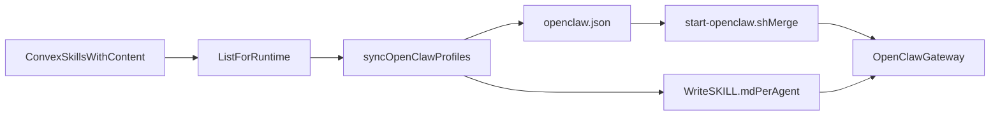

# Agent Skills POC — Real Skills (Updated)

## 1. Context and goal

**What’s already done (agent-profile-sync):**

- Per-agent OpenClaw workspaces under [OPENCLAW_WORKSPACE_ROOT](apps/runtime/src/config.ts) (e.g. `/root/clawd/agents/<slug>/`) with SOUL.md, AGENTS.md, TOOLS.md, memory/, deliverables/.
- Runtime calls [listAgentsForRuntime](packages/backend/convex/service/actions.ts) and [syncOpenClawProfiles](apps/runtime/src/openclaw-profiles.ts) to write workspaces and a generated [openclaw.json](apps/runtime/openclaw/start-openclaw.sh) containing only `agents.list` and `agents.defaults`. Gateway merges this into clawdbot.json at startup.
- Skills are **prompt-only**: [TOOLS.md](apps/runtime/src/openclaw-profiles.ts) lists assigned skill names/descriptions and explicitly says “no SKILL.md files”. No real skill files exist; [start-openclaw.sh](apps/runtime/openclaw/start-openclaw.sh) enables a hardcoded list of OpenClaw skill IDs (peekaboo, bird, …) in `config.skills.entries`, which are unrelated to Convex-assigned skills and may not exist on disk.

**Main goal of this plan:**

- Make skills **real** so OpenClaw can load and execute them: either store skill content (e.g. SKILL.md body) in the database and materialize it on the runtime, or store references to installable skills and ensure they are available and enabled.
- Support **scalable** creation of agents with real skills: one source of truth (Convex), assignment by skill IDs, runtime sync that writes only what’s needed so many agents can have different skill sets without manual file edits.

**Out of scope for this plan (can be a later phase):** Credential/API-key UI and runtime credential storage from the original POC; focus here is “real skills” first. **Skills admin UI** (add/edit skills and contentMarkdown from the dashboard) will be handled later; for this POC, skills are managed via Convex mutations and seed.

---

## 2. Assumptions

- **Per-agent workspaces:** We build on existing per-agent workspaces; no shared single workspace for all agents.
- **Skill storage:** Two complementary models:
  - **Inline/custom:** SKILL.md body stored in Convex (new optional field). Runtime writes these to disk and points OpenClaw at them via `load.extraDirs`.
  - **Reference (optional in POC):** Skill as reference to an installable package (e.g. Clawdhub). Convex stores ref; runtime ensures the skill is enabled in config (and optionally installed to a known path). Can be phased after inline skills.
- **OpenClaw behavior:** OpenClaw discovers skills via `load.extraDirs` and/or bundled skills, and enables them via `skills.entries[id].enabled`. We will generate config that sets `load.extraDirs` and `skills.entries` from Convex-assigned skills so that the “path” we pass actually exists (we create it).

---

## 3. High-level design

### 3.1 Data model (Convex)

- **Existing:** [skills](packages/backend/convex/schema.ts) table: accountId, name, slug, category, description, config (serverUrl, authType, credentialRef, …), isEnabled. No content or path.
- **Add (recommended):**
  - Optional **contentMarkdown** (string): full SKILL.md body for custom/inline skills. When set, runtime will write `<agentWorkspace>/skills/<slug>/SKILL.md`.
  - Optionally extend **config** with **source** and **packageId** (or similar) for reference-based skills (e.g. Clawdhub) in a later step; POC can focus on inline content first.

### 3.2 Backend (Convex)

- **listForRuntime** (or payload from it) must expose **skill content** when present: e.g. include `contentMarkdown` (or a safe subset) for each resolved skill so the runtime can write SKILL.md. Keep filtering to enabled skills only ([service/agents.ts](packages/backend/convex/service/agents.ts) already filters by `skill.isEnabled`).
- No new tables required for “real skills”; only schema extension and runtime payload extension.

### 3.3 Runtime (profile sync + OpenClaw config)

- **Materialize SKILL.md for assigned skills that have content:**
  - For each agent, for each assigned skill that has `contentMarkdown`, write to `<agentDir>/skills/<slug>/SKILL.md` (path safe against traversal; reuse [safeAgentSlug](apps/runtime/src/openclaw-profiles.ts) pattern for skill slug).
  - Ensure directory layout is under workspace root and stable (e.g. `skills/<slug>/SKILL.md` only).
- **Generated openclaw.json:**
  - **agents:** Keep current structure (list, defaults) from [buildOpenClawConfig](apps/runtime/src/openclaw-profiles.ts).
  - **load.extraDirs:** Add the path(s) where we wrote SKILL.md. Per-agent: each agent’s workspace has its own `skills` subdir, so extraDirs could be per-agent (e.g. list of `agentDir + '/skills'`). OpenClaw may accept multiple extraDirs; if it only accepts one, use a single **account-level** skills dir (e.g. `<workspaceRoot>/../skills` or a dedicated env like `OPENCLAW_SKILLS_DIR`) and write each skill once per account (same content can be shared by agents).
  - **skills.entries:** For each assigned skill slug, set `skills.entries[slug] = { enabled: true }` (and any other required fields per OpenClaw docs). This replaces or supplements the hardcoded list in start-openclaw.sh for Convex-driven skills.
- **start-openclaw.sh:** When merging the runtime-generated file, merge not only `agents` but also `load` and `skills` from the generated config (e.g. `config.load = generated.load || config.load`, merge `generated.skills.entries` into `config.skills.entries` so Convex-assigned skills are enabled and load.extraDirs is applied).

### 3.4 Flow (summary)

- Convex stores skills (metadata + optional contentMarkdown).
- Runtime fetches agents + resolved skills (including content).
- syncOpenClawProfiles writes SOUL.md, AGENTS.md, TOOLS.md (unchanged) and, for skills with content, `skills/<slug>/SKILL.md`; builds openclaw.json with agents + load.extraDirs + skills.entries.
- Gateway starts; start-openclaw.sh merges generated agents, load, and skills into clawdbot.json so OpenClaw loads from the dirs we created and enables only the Convex-assigned skills.

---

## 4. File and module changes

### 4.1 Backend (Convex)

- **[packages/backend/convex/schema.ts](packages/backend/convex/schema.ts)**
  - Add optional `contentMarkdown: v.optional(v.string())` to the `skills` table. If present, runtime will materialize it as SKILL.md.
- **[packages/backend/convex/skills.ts](packages/backend/convex/skills.ts)**
  - Ensure `create`/`update` accept and persist `contentMarkdown` (optional). Expose it only to account members (or admins only for edit); listForRuntime will need it for runtime.
- **[packages/backend/convex/service/agents.ts](packages/backend/convex/service/agents.ts)**
  - In `listForRuntime`, for each resolved skill, include `contentMarkdown: skill.contentMarkdown ?? undefined` (or omit when empty) so the runtime can write SKILL.md when present.

### 4.2 Runtime

- **[apps/runtime/src/openclaw-profiles.ts](apps/runtime/src/openclaw-profiles.ts)**
  - **Skill slug safety:** Add a `safeSkillSlug(slug: string): string | null` (same idea as safeAgentSlug: alphanumeric, hyphen, underscore; no path traversal).
  - **Write SKILL.md:** In `syncOpenClawProfiles`, for each agent and each resolved skill that has `contentMarkdown`, ensure dir `agentDir/skills/<safeSlug>` and write `SKILL.md` with that content (writeIfChanged to avoid churn).
  - **openclaw.json:** Extend `buildOpenClawConfig` (or a sibling) to:
    - Set `load.extraDirs` to the list of directories where SKILL.md files were written (e.g. per-agent `agentDir + '/skills'` if OpenClaw supports multiple, or a single account-level skills path if we standardize on one dir).
    - Set `skills.entries[slug] = { enabled: true }` for each assigned skill slug (only for skills we actually materialized or that we reference; POC = materialized only).
  - **TOOLS.md:** Keep current prompt-only list; can add a line that “real skills are available under load.extraDirs” if useful. No change required for POC.
- **[apps/runtime/openclaw/start-openclaw.sh](apps/runtime/openclaw/start-openclaw.sh)**
  - When merging the file at OPENCLAW_CONFIG_PATH, merge not only `generated.agents` but also:
    - `config.load = generated.load || config.load` (so extraDirs from runtime are used).
    - Merge `generated.skills.entries` into `config.skills.entries` (e.g. `Object.assign(config.skills.entries, generated.skills?.entries || {})`) so Convex-assigned skills are enabled. Avoid overwriting the entire `config.skills` if the template has other settings (install, etc.).

### 4.3 Seed skills with contentMarkdown

Today seed skills are metadata only (name, slug, description); with **contentMarkdown** you can seed real SKILL.md content so agents get real skills out of the box.

- **[packages/backend/convex/seed.ts](packages/backend/convex/seed.ts)**
  - **Extend seed skills shape:** Add optional `contentMarkdown?: string` to each entry in the `seedSkills` array. Each value is the full SKILL.md body (metadata + content per OpenClaw SKILL.md format). You can set it for all skills or only those that should be real from day one.
  - **Persist in ensureSkills:** In the `ctx.db.insert("skills", { ... })` call inside `ensureSkills`, add `contentMarkdown: s.contentMarkdown ?? undefined` (and ensure the schema includes `contentMarkdown` as in §4.1). Seed only inserts **missing** skills (by slug); it does not overwrite existing rows, so re-running seed will not replace content you added later via Convex.
  - **Result:** After `npx convex run seed:run` (or your seed command), any agent that has those skills in `openclawConfig.skillIds` will get the corresponding SKILL.md materialized under `agentDir/skills/<slug>/SKILL.md` on the next profile sync.

### 4.4 Docs and tests

- **Docs:** Update [docs/runtime/runtime-docker-compose.md](docs/runtime/runtime-docker-compose.md) (and [apps/runtime/README.md](apps/runtime/README.md) if needed) to state that Convex skills can include optional content stored in DB and materialized as SKILL.md under agent workspaces (or shared skills dir), and that openclaw.json is generated with load.extraDirs and skills.entries.
- **Tests:** In [apps/runtime/src/openclaw-profiles.test.ts](apps/runtime/src/openclaw-profiles.test.ts), add tests: (1) when a resolved skill has contentMarkdown, the corresponding SKILL.md is written under `agentDir/skills/<slug>/SKILL.md`; (2) generated openclaw.json includes load.extraDirs and skills.entries for those skills. Add unit test for safeSkillSlug.

---

## 5. Implementation order (concise)

1. **Schema + skills CRUD:** Add `contentMarkdown` to skills table and to create/update in [packages/backend/convex/skills.ts](packages/backend/convex/skills.ts).
2. **Runtime payload:** Extend `listForRuntime` in [packages/backend/convex/service/agents.ts](packages/backend/convex/service/agents.ts) to include `contentMarkdown` for each resolved skill.
3. **Profile sync – write SKILL.md:** In [apps/runtime/src/openclaw-profiles.ts](apps/runtime/src/openclaw-profiles.ts), add safeSkillSlug, then in syncOpenClawProfiles write `skills/<slug>/SKILL.md` when contentMarkdown is present.
4. **Profile sync – config:** In the same module, extend generated openclaw.json with `load.extraDirs` and `skills.entries` from assigned skills.
5. **Gateway merge:** In [apps/runtime/openclaw/start-openclaw.sh](apps/runtime/openclaw/start-openclaw.sh), merge `load` and `skills.entries` from the generated config.
6. **Seed + docs + tests:** Extend seedSkills with contentMarkdown and persist it in ensureSkills; doc updates; openclaw-profiles tests for SKILL.md and config.

---

## 6. Edge cases and risks

- **Path safety:** Reuse the same rigor as agent slugs: sanitize skill slugs (safeSkillSlug), resolve paths under workspace root, reject traversal.
- **Size limits:** Large contentMarkdown could bloat Convex docs; consider size limit or truncation in schema/validation.
- **OpenClaw version:** Confirm that `load.extraDirs` and `skills.entries` format match the OpenClaw version in use (check upstream docs).
- **Multiple agents, same skill:** If we use per-agent `agentDir/skills/`, the same skill content is duplicated per agent; if we use one account-level skills dir, we write each slug once and point extraDirs there. Prefer one account-level dir if OpenClaw supports a single extraDir or if we want to avoid duplication.

---

## 7. What stays from the original POC (later phase)

- Credential requests table and runtime admin endpoint for API keys.
- “Skills & Credentials” admin UI tab (skills management UI will be handled separately by you).
- Skill sync loop that scans installed skills on disk and updates Convex metadata (discovery from workspace).
- OSS readiness (SECURITY.md, CODE_OF_CONDUCT.md, ARCHITECTURE.md).

These are unchanged in scope but deferred; the updated plan prioritizes **real skills via stored content and materialized SKILL.md** so that agents have real, loadable skills in a scalable way. Seed with **contentMarkdown** allows you to ship real skill content from the start without a UI.
