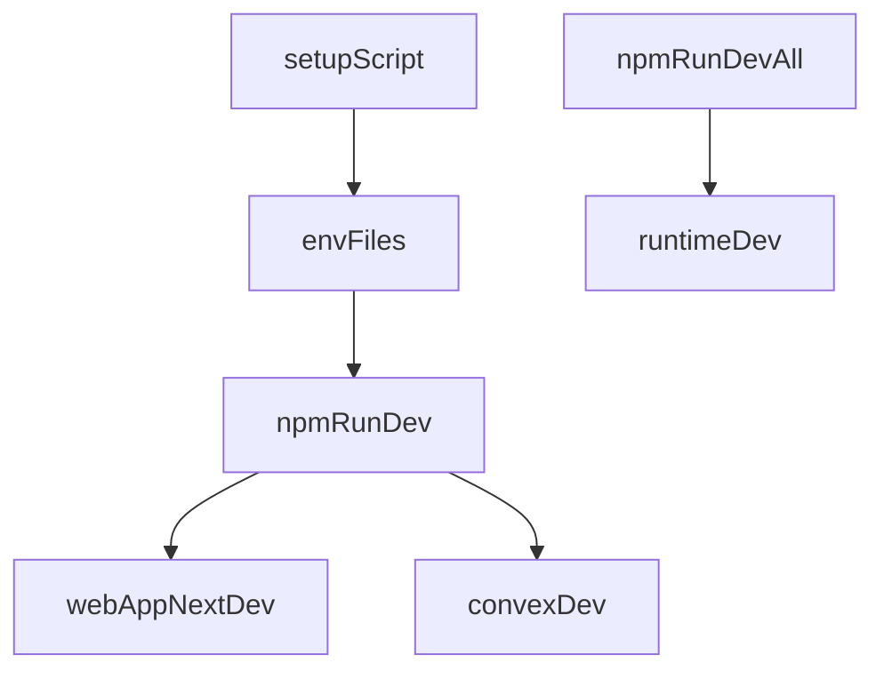

# Monorepo Env + OSS Readiness

## 0. Assumptions & scope

- Assumption A: Root `npm run dev` should start **web + Convex backend only** (runtime optional via separate command).
- Assumption B: The setup script should stay minimal (copy env templates and print next steps, no heavy interactive flow).
- Scope: Update root tooling/config, runtime env loading, and documentation/OSS hygiene across repo.
- Affected areas: `apps/web`, `packages/backend`, `apps/runtime`, `packages/env`, root scripts/config, and documentation.

#### 1. Context & goal

We need consistent, Turbo-friendly environment handling so root dev commands work reliably, plus a fast onboarding path for OSS users. The goal is to (1) make `npm run dev` succeed with minimal setup, (2) ensure Turbo strict env rules don’t drop required variables, (3) provide a simple setup script, and (4) ship missing OSS documentation (security, code of conduct, clearer READMEs).

Key constraints: Turborepo strict env mode, Next.js env validation via `@packages/env`, Convex service-token model, and minimal setup friction for open-source users.

#### 2. Codebase research summary

- Root turbo config uses pass-through only and limited env file tracking: [turbo.json](turbo.json).
- Root dev script currently runs all packages (including runtime): [package.json](package.json).
- Web env vars are defined in a local example and validated at build/runtime: [apps/web/.env.example](apps/web/.env.example), [packages/env/src/nextjs-client.ts](packages/env/src/nextjs-client.ts), [packages/env/src/nextjs-server.ts](packages/env/src/nextjs-server.ts).
- Runtime requires `ACCOUNT_ID`, `CONVEX_URL`, `SERVICE_TOKEN` but doesn’t load `.env` automatically: [apps/runtime/src/config.ts](apps/runtime/src/config.ts), [apps/runtime/src/index.ts](apps/runtime/src/index.ts).
- Runtime service token is generated by a Convex action: [packages/backend/convex/lib/service_auth.ts](packages/backend/convex/lib/service_auth.ts), [packages/backend/convex/service/actions.ts](packages/backend/convex/service/actions.ts).
- Docs exist but have placeholders and lack OSS policies: [README.md](README.md), [CONTRIBUTING.md](CONTRIBUTING.md), [apps/runtime/README.md](apps/runtime/README.md), [docs/runtime/runtime-docker-compose.md](docs/runtime/runtime-docker-compose.md).

#### 3. High-level design

- **Env inventory + Turbo config**: enumerate all env vars used across packages and update Turbo config to (a) hash build-affecting vars and (b) pass-through runtime-only vars. Ensure `.env` file changes are tracked for cache invalidation.
- **Dev scripts**: make root `dev` start only web + backend; add explicit `dev:all`/`dev:runtime` commands for full stack.
- **Runtime env loading**: load `.env` automatically in runtime entry so `npm run dev` in `apps/runtime` and `dev:all` work without shell exports.
- **Setup script**: a minimal script to copy env templates and print next steps (Convex/Clerk setup + service token generation).
- **OSS docs**: update READMEs, fix placeholders, add Code of Conduct + Security policy.

#### 4. File & module changes

Existing files to touch

- [turbo.json](turbo.json): expand env handling; add `globalEnv` for build-affecting vars; add `globalPassThroughEnv` for runtime-only vars; broaden env file dependencies (`**/.env*`).
- [package.json](package.json): change `dev` to web+backend filter; add `dev:all` and `dev:runtime`; add `setup` script.
- [apps/runtime/package.json](apps/runtime/package.json): add `dotenv` dependency (runtime uses it at startup).
- [apps/runtime/src/index.ts](apps/runtime/src/index.ts): load `.env` before `loadConfig()`.
- [README.md](README.md): update quickstart to use `npm run setup`; clarify env sources and Convex/Clerk steps; describe `dev`, `dev:all`, `dev:runtime`; fix `YOUR_ORG` placeholders.
- [CONTRIBUTING.md](CONTRIBUTING.md): update setup steps, fix `YOUR_USERNAME` placeholder, link to Code of Conduct + Security.
- [apps/runtime/README.md](apps/runtime/README.md): mention env auto-loading and setup script; add service-token generation command.
- [docs/runtime/runtime-docker-compose.md](docs/runtime/runtime-docker-compose.md): reference setup script and updated env expectations.

New files to create

- [scripts/setup-env.mjs](scripts/setup-env.mjs): minimal bootstrap to copy env templates and print next steps.
- [CODE_OF_CONDUCT.md](CODE_OF_CONDUCT.md): standard OSS policy (Contributor Covenant or similar).
- [SECURITY.md](SECURITY.md): vulnerability reporting process.
- [apps/web/README.md](apps/web/README.md): app-specific overview, env setup, dev commands (optional but recommended for OSS clarity).

#### 5. Step-by-step tasks

1. **Env inventory & Turbo config**: list all env vars used (`NEXT_PUBLIC_*`, `CLERK_*`, `CONVEX_*`, `SKIP_CONVEX_TYPEGEN`, `ACCOUNT_ID`, `SERVICE_TOKEN`, `HEALTH_*`, `DELIVERY_*`, `LOG_LEVEL`, `UPGRADE_MODE`, `DROPLET_*`, `OPENCLAW_*`, `CLAWDBOT_*`, `VERCEL_AI_GATEWAY_API_KEY`, `ANTHROPIC_API_KEY`, `OPENAI_API_KEY`) and update [turbo.json](turbo.json) to allow/track them appropriately.
2. **Root scripts**: change root `dev` to filter `web-app` + `@packages/backend`; add `dev:all` (full stack) and `dev:runtime` (runtime only) in [package.json](package.json).
3. **Runtime `.env` loading**: add `dotenv` to [apps/runtime/package.json](apps/runtime/package.json) and load it at startup in [apps/runtime/src/index.ts](apps/runtime/src/index.ts) before `loadConfig()`.
4. **Setup script**: add [scripts/setup-env.mjs](scripts/setup-env.mjs) to copy missing env files and print concise next steps, including how to generate `SERVICE_TOKEN` via `npx convex run service/actions:provisionServiceToken`.
5. **README updates**: update [README.md](README.md) and [apps/runtime/README.md](apps/runtime/README.md) with fast setup, explicit env sources, runtime token generation, and new dev commands; fix placeholders.
6. **OSS policies & app docs**: add [CODE_OF_CONDUCT.md](CODE_OF_CONDUCT.md), [SECURITY.md](SECURITY.md), update [CONTRIBUTING.md](CONTRIBUTING.md), and optionally create [apps/web/README.md](apps/web/README.md).

#### 6. Edge cases & risks

- **Turbo strict env filtering**: missing env names in Turbo config can silently break `dev:all` or `build` tasks; mitigate by listing all used env vars and adding a short “env inventory” doc section.
- **Runtime `.env` in production**: `dotenv.config()` should be safe when `.env` is absent; confirm no unintended overrides in Docker/CI.
- **Convex service token generation**: requires auth and a valid account; docs must make this clear to avoid user confusion.
- **Placeholder URLs**: leaving `YOUR_ORG`/`YOUR_USERNAME` breaks badges and clone commands; must be replaced or explained.

#### 7. Testing strategy

- **Smoke tests**: `npm run setup` → `npm run dev` (web + convex) starts without runtime env; `npm run dev:runtime` works when `apps/runtime/.env` is filled.
- **Turbo env correctness**: change a value in `apps/web/.env.local` and verify build cache invalidation for web build tasks.
- **Docs validation**: follow README quickstart on a fresh clone to ensure no missing steps.

#### 8. Rollout / migration (if relevant)

- No data migrations required. Roll out by updating docs and scripts in the same release.
- Add a short “Breaking changes” note in README if `npm run dev` behavior changes from “all” to “web+backend”.

#### 9. TODO checklist

- Audit env vars used across apps and map to Turbo env config.
- Update [turbo.json](turbo.json) env settings and env file dependencies.
- Update root scripts in [package.json](package.json) (`dev`, `dev:all`, `dev:runtime`, `setup`).
- Add `dotenv` and load `.env` in [apps/runtime/src/index.ts](apps/runtime/src/index.ts).
- Add [scripts/setup-env.mjs](scripts/setup-env.mjs) with minimal env bootstrap.
- Update [README.md](README.md), [apps/runtime/README.md](apps/runtime/README.md), and [CONTRIBUTING.md](CONTRIBUTING.md).
- Add [CODE_OF_CONDUCT.md](CODE_OF_CONDUCT.md) and [SECURITY.md](SECURITY.md).
- Optional: add [apps/web/README.md](apps/web/README.md) for app-specific setup.
- Run the smoke tests described above on a clean clone.

