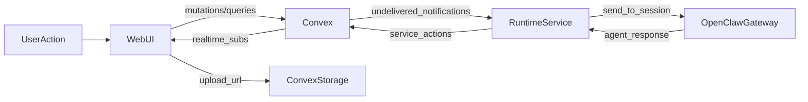

# Production-Ready Refactor & Missing Features Plan

## Audit summary (2025-02-05)

**Already implemented (removed or shortened below):**

- **Backend:** `activities.listByTarget`; `lib/notifications.shouldCreateUserNotification` and preference checks; schema `notificationTypeValidator` includes `member_added`, `member_removed`, `role_changed` (schema only — `lib/validators.ts` still missing these); `messages.generateUploadUrl`, `registerUpload`, `create` with attachments, `listByTask` URL resolution; `documents.listByTask` validates task + membership. OpenClaw runtime: `gateway.sendToOpenClaw`, delivery loop with `markNotificationDelivered`, heartbeat, backoff/retries, idempotent session/heartbeat; health server `/health` and `/version`; config has OpenClaw env (gateway URL, token, timeout).
- **Frontend:** Markdown rendering (`MarkdownRenderer`, `MessageContent` with Streamdown) in task header, detail, docs, messages; @mention autocomplete in `MessageInput` (agents + @all); Kanban agent and status filters and column counts; analytics page with Recharts (Bar/Pie) and `analytics.getSummary`; settings notification preferences; global and dashboard error boundaries (`global-error.tsx`, `[accountSlug]/error.tsx` with `ErrorFallback`); docs page has New Document/Folder and search (Upload File still disabled).
- **Not done / partial:** Auth in `messages.getCount` and `subscriptions.isSubscribed`; `documents.list` taskId ownership check; `lib/validators.ts` notification types; `accounts.create` activity log; separate `files` table and doc upload flow; document versions/shares; `mentions.listCandidates` (members + agents); bulk task mutations; analytics time-series and search filters/cursor; Stripe billing; wire MessageInput attachments (generateUploadUrl → registerUpload → create); render attachments in MessageItem; Task Activity tab; Kanban bulk actions; agent templates; command palette; /live and /ready, metrics, correlation IDs; Stripe in env; extra tests.

## 0. Assumptions & scope

- **Scope:** `apps/web`, `packages/backend`, `apps/runtime`, `packages/shared`, `packages/ui`, plus env examples and docs.
- **Dependencies to add:** `stripe`, `react-markdown`, `remark-gfm`, `rehype-sanitize`, `recharts` (and `cmdk` if not pulled by shadcn).
- **UI components to add via shadcn CLI:** `command`, `form`, `switch`, `table`, `progress`, `radio-group`, `slider`.
- **Assumption A:** Billing uses Stripe (Checkout + Customer Portal + webhooks).
- **Assumption B:** File uploads use Convex File Storage (upload URLs + `storageId`).
- **Assumption C:** “Rich text” is Markdown editing with preview (not WYSIWYG).
- **Assumption D:** Analytics charts use Recharts with date range filters.
- **Assumption E:** All changes preserve multi-tenancy, `requireAccountMember` guards, and `logActivity` for state changes.
- **Implementation conventions:** use `@packages/env` for env access, `nuqs` for URL state, `usehooks-ts` for debounce/hotkeys, and add JSDoc to exported functions/components; keep imports at top-level only.

## 1. Context & goal

Bring the current codebase to production-ready quality while implementing all missing product features across UI, backend, and runtime. This includes closing security/auth gaps, finishing runtime OpenClaw integration, enabling uploads and rich text, adding analytics charts and advanced search, and implementing billing and preferences. The plan must keep realtime behavior via Convex, respect multi-tenancy, and add reliable observability and tests.

## 2. Codebase research summary

**Key files inspected**

- Backend core: [packages/backend/convex/schema.ts](packages/backend/convex/schema.ts), [packages/backend/convex/messages.ts](packages/backend/convex/messages.ts), [packages/backend/convex/subscriptions.ts](packages/backend/convex/subscriptions.ts), [packages/backend/convex/documents.ts](packages/backend/convex/documents.ts), [packages/backend/convex/accounts.ts](packages/backend/convex/accounts.ts), [packages/backend/convex/activities.ts](packages/backend/convex/activities.ts), [packages/backend/convex/analytics.ts](packages/backend/convex/analytics.ts), [packages/backend/convex/search.ts](packages/backend/convex/search.ts), [packages/backend/convex/lib/validators.ts](packages/backend/convex/lib/validators.ts), [packages/backend/convex/lib/mentions.ts](packages/backend/convex/lib/mentions.ts), [packages/backend/convex/service/actions.ts](packages/backend/convex/service/actions.ts).
- Web UI: [apps/web/src/components/tasks/MessageInput.tsx](apps/web/src/components/tasks/MessageInput.tsx), [apps/web/src/components/tasks/MessageItem.tsx](apps/web/src/components/tasks/MessageItem.tsx), [apps/web/src/components/tasks/TaskEditDialog.tsx](apps/web/src/components/tasks/TaskEditDialog.tsx), [apps/web/src/components/tasks/TaskHeader.tsx](apps/web/src/components/tasks/TaskHeader.tsx), [apps/web/src/app/(dashboard)/[accountSlug]/tasks/[taskId]/page.tsx](apps/web/src/app/(dashboard)/[accountSlug]/tasks/[taskId]/page.tsx), [apps/web/src/app/(dashboard)/[accountSlug]/docs/page.tsx](apps/web/src/app/(dashboard)/[accountSlug]/docs/page.tsx), [apps/web/src/app/(dashboard)/[accountSlug]/notifications/page.tsx](apps/web/src/app/(dashboard)/[accountSlug]/notifications/page.tsx).
- Runtime: [apps/runtime/src/gateway.ts](apps/runtime/src/gateway.ts), [apps/runtime/src/config.ts](apps/runtime/src/config.ts), [apps/runtime/openclaw/start-openclaw.sh](apps/runtime/openclaw/start-openclaw.sh).
- Shared/env: [packages/shared/src/constants/index.ts](packages/shared/src/constants/index.ts), [packages/shared/src/types/index.ts](packages/shared/src/types/index.ts), [packages/env/src/nextjs-client.ts](packages/env/src/nextjs-client.ts), [packages/env/src/nextjs-server.ts](packages/env/src/nextjs-server.ts).
- Docs: [docs/roadmap/missing-features.md](docs/roadmap/missing-features.md), [docs/quality/testing.md](docs/quality/testing.md), [docs/quality/qa-checklist.md](docs/quality/qa-checklist.md).

**What exists and should be reused**

- Auth guards and tenancy enforcement via `requireAccountMember` and account-scoped indexes.
- Account settings updates already exist in `accounts.update` and include `notificationPreferences` and `agentDefaults`.
- Invitations flow exists in [packages/backend/convex/invitations.ts](packages/backend/convex/invitations.ts) and is wired to the invite page.
- Activity logging helper `logActivity` and notifications helpers (`createMentionNotifications`, `createThreadNotifications`).
- Attachments are already modeled in `messages` schema; document version incrementing exists but no history storage.
- Runtime has logging/backoff, delivery/heartbeat, and OpenClaw send implemented; health server has `/health` and `/version`.

**Confirmed gaps (after audit)**

- Missing auth in `messages.getCount` (no requireAccountMember; load task first) and `subscriptions.isSubscribed` (no task load + membership check). `documents.list` when `taskId` is provided does not validate that the task belongs to `accountId`.
- Account creation does not log `account_created` activity (TODO in code).
- `notificationTypeValidator` in lib/validators.ts is missing `member_added`, `member_removed`, `role_changed` (schema already has them).
- Message input: mention autocomplete (agents + @all) done; attachments UI exists but submit does not wire generateUploadUrl/registerUpload or pass attachments to create. Message rendering uses Markdown (Streamdown) and mentions.
- Docs page has “Upload File” disabled; no file upload flow; no document version history or share links.
- Runtime: OpenClaw send, delivery, heartbeat, health endpoint done; still missing /live and /ready, metrics stub, correlation IDs.
- Backend has Vitest and one test file; no runtime tests; limited coverage for mentions, notifications, workflow, uploads, billing.

## 3. High-level design

We will extend the existing Convex-centric architecture rather than introducing new services:

- **Uploads:** Web app requests a Convex upload URL → uploads file to Convex storage → calls a finalize mutation to create a `files` record → messages/documents reference `fileId` and resolve URLs for display.
- **Markdown:** Done (MarkdownRenderer, MessageContent with Streamdown). Optional: shared Markdown editor component for editing.
- **Mentions:** UI has @mention autocomplete (agents + @all). Optional: `mentions.listCandidates` for members + agents.
- **Analytics & search:** getSummary and analytics charts done. Add time-series query, search filters/cursor, date range, export.
- **Billing:** Stripe actions in Convex; webhook updates a billing table; settings page has placeholder, wire real checkout/portal.
- **Runtime:** OpenClaw send, delivery, heartbeat, health done. Add /live, /ready, metrics stub, correlation IDs.

### 3.1 Data model additions (Convex)

- `files`
  - Fields: `accountId`, `storageId`, `fileName`, `mimeType`, `size`, `uploadedBy`, `createdAt`, `sourceType?`, `sourceId?`.
  - Indexes: `by_account`, `by_account_source` (`accountId`, `sourceType`, `sourceId`).
- `messages.attachments` (schema update)
  - Store `{ fileId, name, type, size }` and resolve `fileUrl` in queries.
- `documentVersions`
  - Fields: `accountId`, `documentId`, `version`, `content`, `updatedBy`, `updatedAt`.
  - Indexes: `by_document`, `by_account`.
- `documents` (schema update)
  - Add `fileId`, `mimeType`, `size` for uploaded files; keep `content` for markdown docs.
- `documentShares`
  - Fields: `accountId`, `documentId`, `token`, `createdBy`, `createdAt`, `expiresAt?`, `revokedAt?`.
  - Indexes: `by_token`, `by_document`.
- `agentTemplates`
  - Fields: `accountId`, `name`, `description?`, `role`, `openclawConfig`, `isDefault`, `createdAt`, `updatedAt`.
  - Indexes: `by_account`, `by_account_default`.
- `billingSubscriptions`
  - Fields: `accountId`, `stripeCustomerId`, `stripeSubscriptionId`, `plan`, `status`, `priceId`, `currentPeriodEnd?`, `cancelAtPeriodEnd?`, `updatedAt`.
  - Indexes: `by_account`, `by_customer`, `by_subscription`.

### 3.2 Convex API contracts (new/updated)

- `files.generateUploadUrl` (mutation): `{ accountId } -> { uploadUrl }` using `requireAccountMember`.
- `files.createFromUpload` (mutation): `{ accountId, storageId, fileName, mimeType, size, sourceType?, sourceId? } -> { fileId }`.
- `files.listByIds` (query): `{ accountId, fileIds[] } -> { files: [{ fileId, url, fileName, mimeType, size }] }`.
- `documents.list` (query): add `searchQuery?` and `taskId` account validation; include `fileId?` and `fileUrl?` for file docs.
- `documents.create/update` (mutation): allow `kind: "file" | "folder"`; for file docs accept `fileId` or `content` (markdown); validate parent/task/account.
- `document_versions.listByDocument` (query) and `document_versions.restore` (mutation) with activity logging.
- `document_shares.create`/`document_shares.revoke` (mutations), `document_shares.getByToken` (public query) with expiry checks.
- `mentions.listCandidates` (query): `{ accountId, query? } -> { users: [], agents: [] }` (for autocomplete).
- `tasks.bulkUpdateStatus`/`tasks.bulkUpdateAssignees` (mutations) to support Kanban bulk actions.
- `analytics.getTimeSeries` (query): `{ accountId, start, end, bucket } -> { points[] }`.
- `search.globalSearch` (query): add `filters` for status/type/assignee/date range; return `nextCursor`.
- `billing.createCheckoutSession`/`billing.createPortalSession` (actions) and `billing.getByAccount` (query).
- `http.ts` webhook route: Stripe signature verification and internal mutation to upsert `billingSubscriptions`.
- `lib/notifications.shouldCreateUserNotification` helper honoring `accounts.settings.notificationPreferences`.

### 3.3 Core flows (end-to-end)

- **Upload flow:** UI calls `files.generateUploadUrl` → POST file to URL → `files.createFromUpload` → add `fileId` to message/document mutation → queries resolve `fileUrl` via `ctx.storage.getUrl`.
- **Mention autocomplete:** UI debounces input after `@` → `mentions.listCandidates` → select inserts `@name` token → `messages.create` parses mentions and creates notifications.
- **Document sharing:** UI requests `document_shares.create` → copies link → `document_shares.getByToken` renders read-only doc; revoke sets `revokedAt`.
- **Billing:** Settings page triggers `billing.createCheckoutSession`/`createPortalSession` → Stripe webhook updates `billingSubscriptions` → UI reflects plan/status.
- **Runtime delivery:** Runtime polls `service.actions.listUndeliveredNotifications` → `gateway.sendToOpenClaw` → `service.actions.markNotificationDelivered` (idempotent) with retry/backoff.

## 4. File & module changes

### Backend (existing files)

- [packages/backend/convex/messages.ts](packages/backend/convex/messages.ts)
  - Add `requireAccountMember` to `getCount` by loading the task first. (Attachment shape and URL resolution already exist; Markdown rendering done in UI.)
- [packages/backend/convex/subscriptions.ts](packages/backend/convex/subscriptions.ts)
  - Validate task and enforce membership in `isSubscribed`.
- [packages/backend/convex/documents.ts](packages/backend/convex/documents.ts)
  - Validate `taskId` belongs to `accountId` in `list` when filtering by task.
  - Support file-backed documents (`fileId`, `mimeType`, `size`) and markdown docs; persist document version history.
- [packages/backend/convex/accounts.ts](packages/backend/convex/accounts.ts)
  - Log `account_created` activity after account creation.
- [packages/backend/convex/analytics.ts](packages/backend/convex/analytics.ts)
  - Add time-series queries for tasks/activities within date ranges (getSummary done).
- [packages/backend/convex/search.ts](packages/backend/convex/search.ts)
  - Add filters (status, type, date range, assignee) and pagination cursor.
- [packages/backend/convex/lib/validators.ts](packages/backend/convex/lib/validators.ts)
  - Align `notificationTypeValidator` with schema (add `member_added`, `member_removed`, `role_changed`). Optionally extend `attachmentValidator` for `fileId` if using `files` table.
- [packages/backend/convex/lib/notifications.ts](packages/backend/convex/lib/notifications.ts)
  - Done: preferences and `shouldCreateUserNotification`.
- [packages/backend/convex/tasks.ts](packages/backend/convex/tasks.ts)
  - Add bulk mutations for status changes and assignee updates (for Kanban bulk actions).
- [packages/backend/convex/schema.ts](packages/backend/convex/schema.ts)
  - Add tables: `files`, `documentVersions`, `agentTemplates`, `billingSubscriptions`, `documentShares`.
  - Add fields to `documents` for `fileId`, `mimeType`, `size` (file-backed docs).

### Backend (new files)

- [packages/backend/convex/files.ts](packages/backend/convex/files.ts)
  - `generateUploadUrl` (mutation), `createFromUpload` (mutation), `listByIds` (query).
- [packages/backend/convex/document_versions.ts](packages/backend/convex/document_versions.ts)
  - `listByDocument` (query) and `restore` (mutation) with activity logging.
- [packages/backend/convex/agent_templates.ts](packages/backend/convex/agent_templates.ts)
  - `listByAccount`, `create`, `update`, `remove` with admin checks.
- [packages/backend/convex/billing.ts](packages/backend/convex/billing.ts)
  - `createCheckoutSession`, `createPortalSession` (actions), `getByAccount` (query).
- [packages/backend/convex/http.ts](packages/backend/convex/http.ts)
  - Stripe webhook route to upsert `billingSubscriptions` (signature-verified).
- [packages/backend/convex/document_shares.ts](packages/backend/convex/document_shares.ts)
  - `create`, `revoke`, `getByToken` for share links.
- [packages/backend/convex/mentions.ts](packages/backend/convex/mentions.ts)
  - `listCandidates` query for mention autocomplete.

### Web app (existing files)

- [apps/web/src/components/tasks/MessageInput.tsx](apps/web/src/components/tasks/MessageInput.tsx)
  - Done: mention autocomplete (agents + @all). Remaining: wire file attachment upload (generateUploadUrl → registerUpload → create with attachments).
- [apps/web/src/components/tasks/MessageItem.tsx](apps/web/src/components/tasks/MessageItem.tsx)
  - Done: Markdown via MessageContent. Remaining: render attachments list/preview.
- [apps/web/src/components/tasks/TaskEditDialog.tsx](apps/web/src/components/tasks/TaskEditDialog.tsx)
  - Optional: shared Markdown editor (description already supports Markdown).
- [apps/web/src/components/tasks/TaskHeader.tsx](apps/web/src/components/tasks/TaskHeader.tsx)
  - Done: Markdown preview for description.
- [apps/web/src/components/tasks/KanbanBoard.tsx](apps/web/src/components/tasks/KanbanBoard.tsx)
  - Done: filters (agent, status), column counts. Remaining: bulk actions.
- [apps/web/src/components/tasks/KanbanColumn.tsx](apps/web/src/components/tasks/KanbanColumn.tsx)
  - Done: count badges and column-level actions.
- [apps/web/src/app/(dashboard)/[accountSlug]/tasks/[taskId]/page.tsx](apps/web/src/app/(dashboard)/[accountSlug]/tasks/[taskId]/page.tsx)
  - Add Activity tab (TaskActivityTimeline + activities.listByTarget).
- [apps/web/src/app/(dashboard)/[accountSlug]/docs/page.tsx](apps/web/src/app/(dashboard)/[accountSlug]/docs/page.tsx)
  - Enable upload, preview for file docs, sharing UI, version history UI.
- [apps/web/src/app/(dashboard)/[accountSlug]/agents/page.tsx](apps/web/src/app/(dashboard)/[accountSlug]/agents/page.tsx)
  - Search, filters, bulk actions, templates selector (as needed).
- [apps/web/src/app/(dashboard)/[accountSlug]/analytics/page.tsx](apps/web/src/app/(dashboard)/[accountSlug]/analytics/page.tsx)
  - Done: charts (getSummary). Remaining: date range selector, export.
- [apps/web/src/app/(dashboard)/[accountSlug]/search/page.tsx](apps/web/src/app/(dashboard)/[accountSlug]/search/page.tsx)
  - Advanced filters, pagination cursor, optional search history.
- [apps/web/src/app/(dashboard)/[accountSlug]/settings/page.tsx](apps/web/src/app/(dashboard)/[accountSlug]/settings/page.tsx)
  - Done: notification preferences. Remaining: real Billing section (Stripe checkout/portal).
- [apps/web/src/app/(dashboard)/[accountSlug]/notifications/page.tsx](apps/web/src/app/(dashboard)/[accountSlug]/notifications/page.tsx)
  - Add type filter and bulk mark-as-read actions.

### Web app (new files)

- [apps/web/src/components/editor/MarkdownEditor.tsx](apps/web/src/components/editor/MarkdownEditor.tsx) — optional
  - Shared Markdown editor with preview toggle (MarkdownRenderer already used for display).
- [apps/web/src/components/files/FileUploader.tsx](apps/web/src/components/files/FileUploader.tsx)
  - Reusable upload workflow (or wire existing MessageInput attachment UI to messages.generateUploadUrl/registerUpload).
- [apps/web/src/components/mentions/MentionCombobox.tsx](apps/web/src/components/mentions/MentionCombobox.tsx) — optional
  - Dedicated @mention component (MessageInput already has inline mention dropdown for agents + @all).
- [apps/web/src/components/tasks/TaskActivityTimeline.tsx](apps/web/src/components/tasks/TaskActivityTimeline.tsx)
  - Renders `activities.listByTarget` results for Activity tab.
- [apps/web/src/components/analytics/Charts.tsx](apps/web/src/components/analytics/Charts.tsx) — optional
  - Extract or extend (analytics page already has Recharts).
- [apps/web/src/components/command/CommandPalette.tsx](apps/web/src/components/command/CommandPalette.tsx)
  - Cmd+K palette and shortcut help.
- [apps/web/src/components/settings/BillingSection.tsx](apps/web/src/components/settings/BillingSection.tsx)
  - Real Stripe checkout/portal (settings has placeholder).
- [apps/web/src/app/(dashboard)/error.tsx](apps/web/src/app/(dashboard)/error.tsx)
  - Done: dashboard error boundary (ErrorFallback with retry).
- [apps/web/src/app/share/[token]/page.tsx](apps/web/src/app/share/[token]/page.tsx)
  - Public, read-only document share view.

### Runtime

- [apps/runtime/src/gateway.ts](apps/runtime/src/gateway.ts)
  - Done: OpenClaw send (and session lifecycle). Shutdown already integrated.
- [apps/runtime/src/delivery.ts](apps/runtime/src/delivery.ts)
  - Done: backoff/retries, markNotificationDelivered. Optional: explicit idempotency cache.
- [apps/runtime/src/heartbeat.ts](apps/runtime/src/heartbeat.ts)
  - Done: retry and idempotent scheduling.
- [apps/runtime/src/health.ts](apps/runtime/src/health.ts)
  - Done: `/health`, `/version`. Remaining: `/live` and `/ready` (or document /health as readiness).
- [apps/runtime/src/logger.ts](apps/runtime/src/logger.ts)
  - Done: structured levels and secret redaction. Remaining: correlation/request IDs.
- [apps/runtime/src/config.ts](apps/runtime/src/config.ts)
  - Done: OpenClaw gateway URL, token, timeout. Optional: Zod validation, metrics env.
- New helpers (optional): [apps/runtime/src/idempotency.ts](apps/runtime/src/idempotency.ts), [apps/runtime/src/metrics.ts](apps/runtime/src/metrics.ts).

### Shared/UI packages

- [packages/shared/src/types/index.ts](packages/shared/src/types/index.ts)
  - Add `RuntimeStatus` type.
- [packages/shared/src/constants/index.ts](packages/shared/src/constants/index.ts)
  - Optional: centralize priority/activity label maps for reuse.
- `packages/ui` (new shadcn components)
  - Add `command`, `form`, `switch`, `table`, `progress`, `radio-group`, `slider`.

### Environment & docs

- [apps/web/.env.example](apps/web/.env.example)
  - Add Stripe public/secret keys and webhook secret.
- [packages/env/src/nextjs-client.ts](packages/env/src/nextjs-client.ts)
  - Add `NEXT_PUBLIC_STRIPE_PUBLISHABLE_KEY`.
- [packages/env/src/nextjs-server.ts](packages/env/src/nextjs-server.ts)
  - Add `STRIPE_SECRET_KEY`, `STRIPE_WEBHOOK_SECRET`, and `STRIPE_PRICE_ID_*` entries.
- [apps/runtime/.env.example](apps/runtime/.env.example)
  - Add OpenClaw gateway endpoint/token and metrics settings.
- `docs/` updates for billing and uploads setup.

## 5. Step-by-step tasks

1. **Backend auth + validator alignment**
   - `messages.getCount`: load task → `requireAccountMember` → count messages by task index.
   - `subscriptions.isSubscribed`: load task → `requireAccountMember` → lookup subscription.
   - `documents.list` with `taskId`: validate task belongs to `accountId`.
   - `lib/validators.ts`: add missing notification types; extend attachment validator.
   - `accounts.create`: add `logActivity` for `account_created`.
2. **Env + dependency setup**
   - Add Stripe env vars to `packages/env` and `apps/web/.env.example`.
   - Add new deps in root `package.json` and add shadcn components via CLI.
3. **Schema additions**
   - Add `files`, `documentVersions`, `documentShares`, `agentTemplates`, `billingSubscriptions`.
   - Add `fileId`, `mimeType`, `size` to `documents` for file-backed docs.
4. **File upload backend**
   - Done for messages: `messages.generateUploadUrl`, `registerUpload`, `create` with attachments (storageId), `listByTask` resolves URL. Frontend not wired.
   - For docs: add `files` table and `files.generateUploadUrl`, `files.createFromUpload`, `files.listByIds`; or reuse messageUploads pattern for doc uploads.
5. **Document version history + sharing**
   - Insert prior content into `documentVersions` before updates.
   - `document_versions.listByDocument` + `document_versions.restore`.
   - `document_shares.create`, `document_shares.revoke`, `document_shares.getByToken`.
6. **Mentions autocomplete API**
   - `mentions.listCandidates` query with `{ accountId, query? }`.
   - Return both members and agents with `id`, `displayName`, `handle`.
7. **Markdown editor + preview UI** — mostly done
   - Done: MarkdownRenderer, MessageContent (Streamdown) for description and message rendering.
   - Optional: shared MarkdownEditor (Textarea + preview) for editing.
8. **Message input upgrades**
   - Done: mention autocomplete (agents + @all) inline in MessageInput.
   - Remaining: wire attachments (generateUploadUrl → registerUpload → create); show upload progress and chip list; render attachments in MessageItem.
9. **Documents UI upgrades**
   - Enable Upload File button and integrate `FileUploader`.
   - Add read-only preview for uploaded files and Markdown docs.
   - Add version history panel and restore action.
   - Add share link UI with copy-to-clipboard and public `/share/[token]` page.
10. **Task detail + Kanban improvements**
    - Remaining: Add Activity tab using `TaskActivityTimeline` and `activities.listByTarget`.
    - Done: Kanban filters (agent, status) and column counts.
    - Remaining: bulk actions UI and hook to `tasks.bulkUpdate*` mutations.
11. **Agents roster improvements**
    - Add search and status filters using `nuqs`.
    - Add bulk status updates.
    - Add templates (CRUD) and integrate into Create Agent dialog.
12. **Search + analytics upgrades**
    - Add filtered search with pagination cursor.
    - Add analytics time-series query and charts with date range selector.
13. **Notifications + preferences**
    - Done: notification preferences in settings; `lib/notifications` honors preferences and `shouldCreateUserNotification` exists.
    - Remaining: unit tests for preference logic; notification type filter and bulk mark as read in UI.
14. **Billing (Stripe)**
    - Implement `billing.createCheckoutSession` / `billing.createPortalSession`.
    - Implement webhook in `http.ts` and upsert `billingSubscriptions`.
    - Add `BillingSection` in settings (plan/status/actions).
15. **Command palette + shortcuts**
    - Add `CommandPalette` with Cmd+K, using `search.globalSearch`.
    - Add shortcuts modal/help (e.g., Cmd+K, / to focus search).
16. **Runtime hardening**
    - Done: OpenClaw send, delivery loop with retries/backoff, markNotificationDelivered, heartbeat, health server (/health, /version).
    - Remaining: `/live` and `/ready` (or document /health as readiness), basic metrics stub, correlation IDs in logs.
17. **Tests + QA**
    - Add Vitest configs for backend/runtime and write unit tests.
    - Add integration tests for upload flow, billing webhook, runtime delivery.
    - Run manual QA checklist from `docs/quality/qa-checklist.md`.
18. **Docs**
    - Update docs with Stripe setup, uploads, runtime health/metrics, and test commands.

## 6. Edge cases & risks

- **Multi-tenancy leaks:** ensure new file, version, and share queries validate account membership before returning data.
- **Upload security:** storage URLs should be short-lived and only created for authorized users; file metadata must be account-scoped.
- **File ownership:** validate `fileId` belongs to account before attaching to messages/docs.
- **Markdown XSS:** render with `rehype-sanitize` and block raw HTML.
- **Idempotency & retries:** avoid duplicate notification deliveries and message inserts on runtime retries.
- **Billing webhooks:** ensure signature verification and idempotent updates to billing records.
- **Performance:** search and analytics queries should bound data; use indexes and date ranges.
- **Share links:** require token-based access with revocation and expiry.

## 7. Testing strategy

- **Unit tests (Vitest):**
  - `packages/backend`:
    - `convex/lib/mentions.ts`: mention parsing and candidate resolution.
    - `convex/lib/notifications.ts`: preference logic (`shouldCreateUserNotification`).
    - `convex/lib/task_workflow.ts`: status transition rules.
    - `convex/files.ts`: attachment validation + URL resolution with storage.
    - `convex/billing.ts`: Stripe signature verification helper.
  - `apps/runtime`:
    - delivery idempotency cache behavior and retry logic.
- **Integration tests:**
  - Upload flow: generate URL → upload → finalize → message/doc renders with attachment.
  - Billing flow: checkout session created → webhook updates billing record.
  - Runtime delivery: undelivered notification → OpenClaw send → mark delivered.
- **Manual QA checklist (reference):**
  - Use [docs/quality/qa-checklist.md](docs/quality/qa-checklist.md) as baseline.
  - Add coverage for uploads, shares, billing, command palette, and analytics charts.
  - Align with [docs/quality/testing.md](docs/quality/testing.md) when adding new test commands.

## 8. Rollout / migration

- **Migrations:** add new tables (`files`, `documentVersions`, `agentTemplates`, `billingSubscriptions`, `documentShares`) and backfill where needed (e.g., initial document version = 1).
- **Backfill details:** existing markdown docs get `documentVersions` entry on first update; file-backed docs leave `content` undefined and use `fileId`.
- **Feature flags:** gate billing and share links behind flags in `systemConfig` until verified.
- **Observability:** add runtime metrics and logging fields for delivery attempts, failures, and webhook processing.

## 9. TODO checklist (remaining after audit)

**Backend**

- [ ] Fix auth/validation: `messages.getCount` (load task + requireAccountMember), `subscriptions.isSubscribed` (load task + requireAccountMember), `documents.list` (validate task belongs to accountId when taskId provided), `lib/validators.ts` (add member_added, member_removed, role_changed to notificationTypeValidator).
- [ ] Log `account_created` in `accounts.create`.
- [ ] Add schema tables: `files`, `documentVersions`, `documentShares`, `agentTemplates`, `billingSubscriptions`; add `fileId`, `mimeType`, `size` to documents.
- [ ] Implement `files.generateUploadUrl`, `files.createFromUpload`, `files.listByIds` (or keep messageUploads flow and add doc upload path).
- [ ] Document version history and share links (document_versions, document_shares).
- [ ] Optional: `mentions.listCandidates` (members + agents) for richer autocomplete.
- [ ] Bulk task mutations (bulkUpdateStatus, bulkUpdateAssignees) for Kanban.
- [ ] Analytics time-series query; search filters + pagination cursor.
- [ ] Stripe billing: actions (createCheckoutSession, createPortalSession), webhook in http.ts, getByAccount query.

**Frontend**

- [ ] Wire MessageInput attachments: call generateUploadUrl → upload → registerUpload → create with attachments; render attachments in MessageItem.
- [ ] Add Task Activity tab (TaskActivityTimeline + activities.listByTarget) on task detail page.
- [ ] Kanban bulk actions UI (hook to bulk mutations).
- [ ] Agents: search/filters, templates workflow (if agent_templates added).
- [ ] Advanced search: filters, pagination cursor, optional history.
- [ ] Analytics: date range selector, CSV export.
- [ ] Billing section in settings (real Stripe checkout/portal; placeholder exists).
- [ ] Command palette (Cmd+K) + shortcuts modal.
- [ ] Notifications page: type filter, bulk mark as read.
- [ ] Docs: enable Upload File, version history UI, share link UI, public `/share/[token]` page.

**Runtime**

- [ ] Add `/live` and `/ready` endpoints (or document /health as readiness).
- [ ] Metrics stub and correlation IDs in logger/delivery/heartbeat.

**Tests & QA**

- [ ] Vitest config for runtime (backend already has one).
- [ ] Unit tests: mentions parsing, notification preferences, task workflow, upload flow, billing helpers.
- [ ] Integration tests: upload flow, billing webhook, runtime delivery.
- [ ] Run manual QA checklist for new flows.

**Infra / Docs**

- [ ] Add Stripe vars to `packages/env` and `apps/web/.env.example`.
- [ ] Document billing setup, upload flow, runtime health/metrics, test commands.

