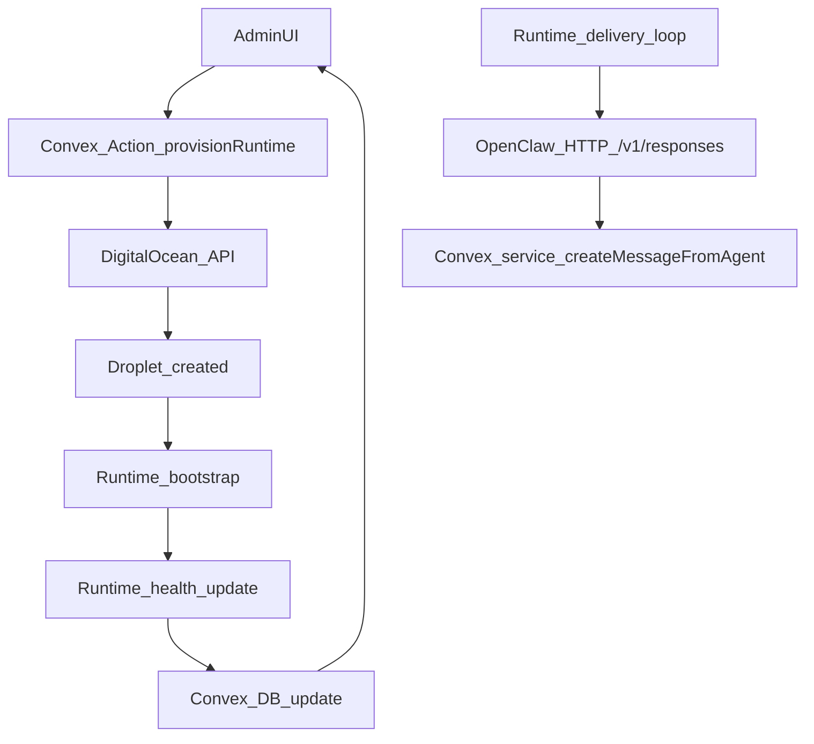

# Minimal Runtime v1 Release Plan

## 1. Context & goal

We need a release-ready v1 path for per-account runtimes that can be provisioned automatically on DigitalOcean, reliably send/receive OpenClaw messages, and manage provider API keys securely from the admin UI. This must follow the current LobsterControl architecture (Convex as shared brain, one runtime server per account, strict tenancy) and align the OpenClaw Docker setup with `clawdbot-docker` while preserving your Vercel AI Gateway defaults. Value: removes manual ops, enables real agent execution, reduces onboarding friction, and makes the project safe to open source.

Key constraints:

- Runtime is **one VPS per account** (hard requirement).
- Service-only auth for runtime actions (`SERVICE_TOKEN`).
- No cross-account access; all data filtered by `accountId`.
- Secrets must be stored encrypted and never logged.
- Runtime must be idempotent and resilient to crashes/retries.
- Docker-first deployment and persistence required.

Assumptions:

- Assumption A: DigitalOcean is the only v1 provider.
- Assumption B: Convex actions can call DigitalOcean APIs and store a DO token in env.
- Assumption C: OpenClaw Gateway HTTP API (`/v1/responses`) will be used for runtime→OpenClaw messaging; it will be enabled in gateway config.
- Assumption D: Secrets are encrypted in Convex using an env-provided key (e.g., `SECRETS_MASTER_KEY_BASE64`), and only decrypted in service actions.

## 2. Codebase research summary

Inspected:

- [apps/runtime/src/gateway.ts](apps/runtime/src/gateway.ts) — session registry and `sendToOpenClaw` placeholder.
- [apps/runtime/src/delivery.ts](apps/runtime/src/delivery.ts) — delivery loop + backoff.
- [apps/runtime/src/heartbeat.ts](apps/runtime/src/heartbeat.ts) — heartbeat scheduling.
- [apps/runtime/src/agent-sync.ts](apps/runtime/src/agent-sync.ts) — periodic agent sync (already exists).
- [apps/runtime/src/health.ts](apps/runtime/src/health.ts) — health + runtime status update.
- [apps/runtime/src/config.ts](apps/runtime/src/config.ts) — env config validation.
- [apps/runtime/openclaw/start-openclaw.sh](apps/runtime/openclaw/start-openclaw.sh) — custom OpenClaw config merge.
- [apps/runtime/openclaw/openclaw.json.template](apps/runtime/openclaw/openclaw.json.template) — OpenClaw defaults.
- [apps/runtime/docker-compose.runtime.yml](apps/runtime/docker-compose.runtime.yml) — runtime + gateway compose.
- [apps/runtime/openclaw/Dockerfile](apps/runtime/openclaw/Dockerfile) — OpenClaw image build.
- [apps/runtime/README.md](apps/runtime/README.md) — runtime ops and env.
- [packages/backend/convex/service/actions.ts](packages/backend/convex/service/actions.ts) — service token and runtime actions.
- [packages/backend/convex/accounts.ts](packages/backend/convex/accounts.ts) — runtime status updates.
- [packages/backend/convex/runtimes.ts](packages/backend/convex/runtimes.ts) — runtime record + upgrades.
- [packages/backend/convex/schema.ts](packages/backend/convex/schema.ts) — accounts/runtimes schema.
- [apps/web/src/app/(dashboard)/[accountSlug]/admin/openclaw/page.tsx](apps/web/src/app/(dashboard)/[accountSlug]/admin/openclaw/page.tsx) — admin runtime config + service token UI.
- [apps/web/src/app/(dashboard)/[accountSlug]/admin/fleet/page.tsx](apps/web/src/app/(dashboard)/[accountSlug]/admin/fleet/page.tsx) — fleet admin UI.
- Upstream `clawdbot-docker` repo (README, `docker-compose.yml`, `start-openclaw.sh`, `openclaw.json.template`).

Patterns to reuse:

- Service-only actions in `packages/backend/convex/service/actions.ts` with `requireServiceAuth`.
- Runtime health reporting already calls `api.service.actions.updateRuntimeStatus`.
- Agent sync already updates gateway sessions and heartbeat schedules.
- OpenClaw Docker setup already forks from clawdbot-docker but diverges from upstream env merge logic.

## 3. High-level design

### Architecture summary

- **Web app** (admin UI) triggers provisioning and secrets updates.
- **Convex actions** handle provisioning (DigitalOcean API) and secrets encryption.
- **Runtime service** fetches secrets, polls notifications, and sends messages to OpenClaw Gateway via HTTP (`/v1/responses`).
- **OpenClaw Gateway** runs in a container configured from env via `start-openclaw.sh`, with persistence on disk.

### Main data flows

1. **Provisioning**

Admin UI → Convex action `provisionRuntime` → DigitalOcean droplet create (cloud-init) → runtime container boots → runtime reports health → Convex updates `accounts.runtimeStatus` and `runtimes`.
2. **Notification delivery**
Convex notifications → runtime delivery loop → OpenClaw `POST /v1/responses` with `x-openclaw-session-key` → agent response → runtime posts message to Convex via service action.
3. **Secrets management**
Admin UI → Convex action `secrets.upsertProviderKey` → encrypt + store → runtime service action `secrets.getRuntimeSecrets` → runtime injects env/config for OpenClaw + triggers restart if needed.

### Mermaid (v1 provisioning + runtime loop)

## 4. File & module changes

### Backend (Convex)

- [packages/backend/convex/schema.ts](packages/backend/convex/schema.ts)
  - Add `secrets` table for encrypted provider keys (`accountId`, `provider`, `ciphertext`, `keyId`, `updatedAt`).
  - Optionally add `runtimeProvisioning` table if you want job tracking; otherwise reuse `runtimes.status = provisioning`.
- [packages/backend/convex/secrets.ts](packages/backend/convex/secrets.ts) (new)
  - Mutations/actions to `upsertProviderKey`, `removeProviderKey`, `listProviderKeys` (metadata only).
- [packages/backend/convex/lib/secrets.ts](packages/backend/convex/lib/secrets.ts) (new)
  - AES-GCM encryption helpers using `SECRETS_MASTER_KEY_BASE64` in Convex env.
- [packages/backend/convex/service/actions.ts](packages/backend/convex/service/actions.ts)
  - Add `getRuntimeSecrets` action for runtime to fetch decrypted provider keys (service-only).
- [packages/backend/convex/provisioning.ts](packages/backend/convex/provisioning.ts) (new)
  - Admin-only `provisionRuntime` action to call DO API and enqueue bootstrap with cloud-init.
- [packages/backend/convex/activities.ts](packages/backend/convex/activities.ts)
  - Log `runtime_provision_requested`, `runtime_provision_failed`, `secret_updated` activities.

### Runtime service

- [apps/runtime/src/config.ts](apps/runtime/src/config.ts)
  - Add `openclawGatewayUrl`, `openclawGatewayToken`, `openclawResponsesEnabled`, and `secretsRefreshInterval`.
- [apps/runtime/src/gateway.ts](apps/runtime/src/gateway.ts)
  - Replace `sendToOpenClaw` TODO with HTTP client to `POST /v1/responses` using `x-openclaw-session-key` and bearer token.
  - Add `probeGateway()` for health/degraded state.
- [apps/runtime/src/health.ts](apps/runtime/src/health.ts)
  - Mark runtime as `degraded` if OpenClaw unreachable or delivery failures exceed threshold.
- [apps/runtime/src/secrets-sync.ts](apps/runtime/src/secrets-sync.ts) (new)
  - Poll Convex for secrets, update local env/config material, and trigger restart when keys change.
- [apps/runtime/src/index.ts](apps/runtime/src/index.ts)
  - Start `secrets-sync` loop; include OpenClaw gateway URL/token in logs (redacted).

### OpenClaw Docker setup

- [apps/runtime/openclaw/start-openclaw.sh](apps/runtime/openclaw/start-openclaw.sh)
  - Align with clawdbot-docker env merge: provider keys, channels, `OPENCLAW_BIND_HOST`, `CLAWDBOT_GATEWAY_TOKEN`.
  - Enable OpenResponses HTTP endpoint (`gateway.http.endpoints.responses.enabled = true`).
  - Preserve your Vercel AI Gateway defaults + skills enablement.
- [apps/runtime/openclaw/openclaw.json.template](apps/runtime/openclaw/openclaw.json.template)
  - Expand defaults: browser config, models, compaction mode, concurrency, gateway HTTP endpoints.
- [apps/runtime/docker-compose.runtime.yml](apps/runtime/docker-compose.runtime.yml)
  - Add `shm_size: '2gb'` to OpenClaw service.
  - Add `OPENCLAW_BIND_HOST` and `CLAWDBOT_GATEWAY_TOKEN` envs.
  - Export `OPENCLAW_GATEWAY_URL` for runtime (`http://openclaw-gateway:18789`).

### Web admin UI

- [apps/web/src/app/(dashboard)/[accountSlug]/admin/openclaw/page.tsx](apps/web/src/app/(dashboard)/[accountSlug]/admin/openclaw/page.tsx)
  - Add “Provider API Keys” section (Anthropic/OpenAI/Vercel AI Gateway) with secure input and status.
  - Add “Provision Runtime” panel with current runtime status and action button.
- [apps/web/src/app/(dashboard)/[accountSlug]/admin/fleet/page.tsx](apps/web/src/app/(dashboard)/[accountSlug]/admin/fleet/page.tsx)
  - Show provisioning status and last provision error (if any).

### Docs & open-source readiness

- [docs/runtime/runtime-docker-compose.md](docs/runtime/runtime-docker-compose.md)
  - Update with new env vars and OpenResponses endpoint.
- [docs/runtime/provisioning-digitalocean.md](docs/runtime/provisioning-digitalocean.md) (new)
  - Document DO token, droplet sizing, cloud-init/bootstrap, and rollback steps.
- [docs/runtime/secrets-management.md](docs/runtime/secrets-management.md) (new)
  - Explain encryption, rotation, and runtime restart behavior.
- [SECURITY.md](SECURITY.md) (new)
  - Responsible disclosure, secrets handling, and threat model notes.
- [CODE_OF_CONDUCT.md](CODE_OF_CONDUCT.md) (new)
- [CONTRIBUTING.md](CONTRIBUTING.md)
  - Add open-source onboarding + “no secrets in commits”.

## 5. Step-by-step tasks

1. **Finalize OpenClaw transport choice and enable HTTP endpoint**
  - Add OpenResponses endpoint enablement in [apps/runtime/openclaw/start-openclaw.sh](apps/runtime/openclaw/start-openclaw.sh).
  - Update [apps/runtime/openclaw/openclaw.json.template](apps/runtime/openclaw/openclaw.json.template) defaults.
2. **Implement OpenClaw HTTP client**
  - Add gateway URL/token to [apps/runtime/src/config.ts](apps/runtime/src/config.ts).
  - Replace `sendToOpenClaw` in [apps/runtime/src/gateway.ts](apps/runtime/src/gateway.ts) with `POST /v1/responses` using bearer auth and `x-openclaw-session-key`.
  - Ensure errors propagate to delivery loop for retries.
3. **Secrets storage (encrypted in Convex)**
  - Add `secrets` table in [packages/backend/convex/schema.ts](packages/backend/convex/schema.ts).
  - Add encryption helpers in [packages/backend/convex/lib/secrets.ts](packages/backend/convex/lib/secrets.ts).
  - Add CRUD actions in [packages/backend/convex/secrets.ts](packages/backend/convex/secrets.ts).
  - Add service action `getRuntimeSecrets` in [packages/backend/convex/service/actions.ts](packages/backend/convex/service/actions.ts).
4. **Runtime secrets sync + restart behavior**
  - Create [apps/runtime/src/secrets-sync.ts](apps/runtime/src/secrets-sync.ts) to pull secrets and track version hash.
  - On change, update local env/config material and trigger `checkRestartRequested` flow or self-exit for process manager restart.
5. **Provisioning via DigitalOcean API**
  - Create Convex action [packages/backend/convex/provisioning.ts](packages/backend/convex/provisioning.ts) (admin only).
  - Call DO droplet create API with cloud-init to install Docker, pull runtime + OpenClaw images, write `.env`, and start compose.
  - Update `accounts.runtimeStatus` to `provisioning` and log activity.
6. **Docker compose alignment with clawdbot-docker**
  - Update [apps/runtime/docker-compose.runtime.yml](apps/runtime/docker-compose.runtime.yml) with `shm_size`, bind host, gateway token, env pass-through for provider keys.
  - Keep volumes for data/workspace and document persistence paths.
7. **Admin UI additions**
  - Add API key input UI and provisioning UI in [apps/web/src/app/(dashboard)/[accountSlug]/admin/openclaw/page.tsx](apps/web/src/app/(dashboard)/[accountSlug]/admin/openclaw/page.tsx).
  - Wire to new Convex actions for secrets and provisioning.
8. **Observability + status hardening**
  - Update [apps/runtime/src/health.ts](apps/runtime/src/health.ts) to report `degraded` on OpenClaw unreachable or repeated delivery failures.
  - Add activity logs for provisioning and secret updates.
9. **Docs + open-source readiness**
  - Add new docs and update README pointers.
  - Add `SECURITY.md`, `CODE_OF_CONDUCT.md`, and update `CONTRIBUTING.md`.
10. **Testing + QA**

- Add unit tests for encryption helpers and request payloads.
- Add integration test for end-to-end delivery (mock OpenClaw if needed).

## 6. Edge cases & risks

- **OpenClaw endpoint disabled** → Ensure `gateway.http.endpoints.responses.enabled = true` is enforced at boot.
- **Token mismatch / unauthorized** → Runtime should surface clear errors and mark degraded.
- **Secret rotation** → Force runtime restart; ensure old secrets are not reused.
- **Provisioning failures** → Mark runtime status `error`, store error in `runtimes` or an activity log, allow retry.
- **Multi-tenant leakage** → All secrets and provisioning calls must check `accountId` + admin role.
- **Backoff storm** → Delivery loop already has backoff; keep bounded retries.
- **Open-source claims** → Audit UI copy (e.g., SOC2 claims) and remove or gate if unverified.

## 7. Testing strategy

- **Unit tests**
  - Encryption helpers (encrypt/decrypt, bad key, missing env).
  - OpenClaw HTTP client request formation and error mapping.
- **Integration tests**
  - Convex action: secrets upsert → runtime fetches → restart triggered.
  - Delivery loop: notification → OpenClaw HTTP (mock) → message posted in Convex.
- **Manual QA**
  - Provision runtime from admin UI; droplet boots and reports online.
  - Add provider key; verify runtime restarts and OpenClaw uses new model.
  - Create agent; runtime sync sees new agent without restart.
  - Simulate OpenClaw down; runtime shows degraded.

## 8. Rollout / migration

- **Feature flags**
  - `fleet_orchestration_enabled` already exists; use similar flag for provisioning (`runtime_provisioning_enabled`).
- **Secrets migration**
  - No existing data; new table only. Provide fallback path to use env-only keys if no secret stored.
- **Observability**
  - Log provisioning results to `activities` and runtime health status to `runtimes`.

## 9. TODO checklist

**Backend**

- Add `secrets` table to [packages/backend/convex/schema.ts](packages/backend/convex/schema.ts).
- Implement encryption helpers in [packages/backend/convex/lib/secrets.ts](packages/backend/convex/lib/secrets.ts).
- Add secrets CRUD in [packages/backend/convex/secrets.ts](packages/backend/convex/secrets.ts).
- Add `getRuntimeSecrets` to [packages/backend/convex/service/actions.ts](packages/backend/convex/service/actions.ts).
- Add DigitalOcean provisioning action in [packages/backend/convex/provisioning.ts](packages/backend/convex/provisioning.ts).
- Log provisioning + secret updates in `activities`.

**Runtime**

- Add OpenClaw gateway URL/token to [apps/runtime/src/config.ts](apps/runtime/src/config.ts).
- Implement OpenClaw HTTP send in [apps/runtime/src/gateway.ts](apps/runtime/src/gateway.ts).
- Add secrets sync loop in [apps/runtime/src/secrets-sync.ts](apps/runtime/src/secrets-sync.ts).
- Update health status to `degraded` when OpenClaw unreachable.

**OpenClaw Docker**

- Align [apps/runtime/openclaw/start-openclaw.sh](apps/runtime/openclaw/start-openclaw.sh) with clawdbot-docker env merge logic.
- Update [apps/runtime/openclaw/openclaw.json.template](apps/runtime/openclaw/openclaw.json.template) to include HTTP endpoint + defaults.
- Update [apps/runtime/docker-compose.runtime.yml](apps/runtime/docker-compose.runtime.yml) (shm_size, bind host, token, gateway URL).

**Frontend**

- Add API key management UI in [apps/web/src/app/(dashboard)/[accountSlug]/admin/openclaw/page.tsx](apps/web/src/app/(dashboard)/[accountSlug]/admin/openclaw/page.tsx).
- Add runtime provisioning UI + status display in openclaw admin page.
- Surface provisioning status in [apps/web/src/app/(dashboard)/[accountSlug]/admin/fleet/page.tsx](apps/web/src/app/(dashboard)/[accountSlug]/admin/fleet/page.tsx).

**Infra / DevOps**

- Add cloud-init/bootstrap script for droplet (Docker install + compose up).
- Publish runtime + openclaw images to registry (GHCR or DO).
- Add docs for provisioning and secrets.

**Docs / Open Source**

- Add [SECURITY.md](SECURITY.md) and [CODE_OF_CONDUCT.md](CODE_OF_CONDUCT.md).
- Update [CONTRIBUTING.md](CONTRIBUTING.md) with security + setup notes.
- Audit public UI copy for unverified claims.

**Tests**

- Unit tests for secrets encryption/decryption.
- Integration test for delivery loop to OpenClaw HTTP.
- Manual QA checklist for provisioning + secret rotation.

