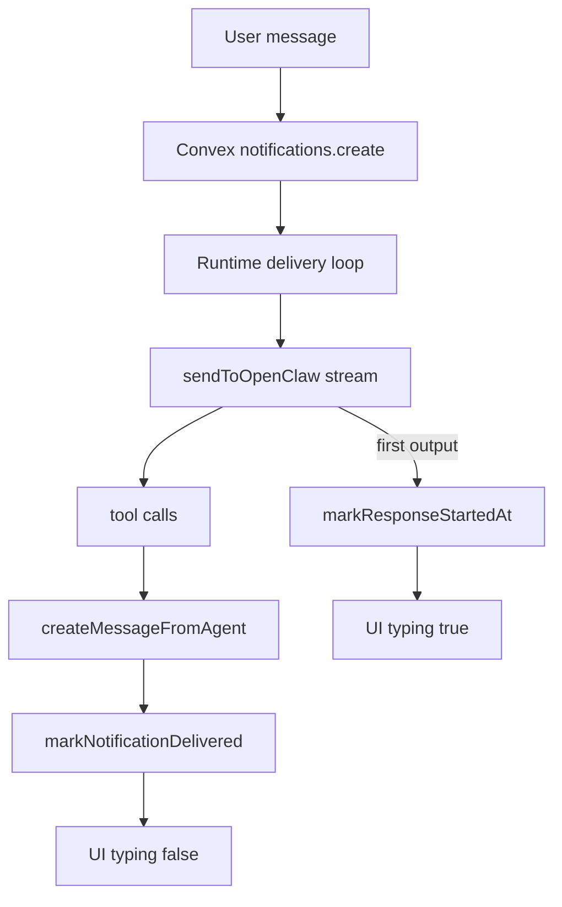

# Streaming-Based Typing Indicators

## 1. Context & goal

We want the “agent is typing” indicator to appear only after the agent has actually started responding (first streamed output or tool call), not merely when the runtime begins processing a notification. This will be done by switching to OpenClaw streaming, recording a `responseStartedAt` timestamp on notifications, and using that timestamp (plus `deliveredAt`) to compute typing indicators in the task thread and agents sidebar. Multi-tenancy and existing notification delivery semantics must remain intact.

User stories and acceptance criteria:

- User story: As a user, I only see “Agent is typing” after the agent has truly started responding (no early typing from notification pickup).
- User story: As a user, the agents sidebar “TYPING” status stays in sync with the task thread typing indicator.
- Acceptance criteria: Typing appears only after `responseStartedAt` is set from streaming output, and disappears when `deliveredAt` is set or the typing window expires.
- Acceptance criteria: Mention-based fallback typing is removed, so no typing is shown if the agent never outputs anything.

Setup checklist (confirm before implementation):

- Requirements/scope documented (this plan).
- User stories and acceptance criteria confirmed.
- Feature branch created (when leaving plan mode).
- Dev environment ready (runtime + Convex + web app).

## 2. Codebase research summary

Files inspected and relevant notes:

- [apps/web/src/components/tasks/TaskThread.tsx](apps/web/src/components/tasks/TaskThread.tsx) — current typing logic uses `readAt` and a mention-based fallback; will be updated to `responseStartedAt` and fallback removal.
- [apps/web/src/components/tasks/AgentsSidebar.tsx](apps/web/src/components/tasks/AgentsSidebar.tsx) — uses `listAgentIdsTypingByAccount` to show “TYPING” status.
- [packages/backend/convex/notifications.ts](packages/backend/convex/notifications.ts) — provides `listAgentReceiptsByTask` and `listAgentIdsTypingByAccount` based on `readAt` and `deliveredAt`.
- [packages/backend/convex/service/notifications.ts](packages/backend/convex/service/notifications.ts) — internal mutations for `markRead` and `markDelivered`.
- [packages/backend/convex/service/actions.ts](packages/backend/convex/service/actions.ts) — service actions `markNotificationRead`/`markNotificationDelivered` with account validation.
- [apps/runtime/src/gateway.ts](apps/runtime/src/gateway.ts) — non-streaming `sendToOpenClaw` and `sendOpenClawToolResults` with response parsing.
- [apps/runtime/src/delivery.ts](apps/runtime/src/delivery.ts) — delivery loop calling `sendToOpenClaw`, then tool execution, then `markNotificationDelivered`.
- [packages/backend/convex/schema.ts](packages/backend/convex/schema.ts) — notifications table fields.
- [docs/quality/code-review-agent-response-writeback.md](docs/quality/code-review-agent-response-writeback.md) — explicitly documents non-streaming behavior; needs update.

## 3. High-level design

We will introduce a new `notifications.responseStartedAt` timestamp set by the runtime when the OpenClaw stream yields its first output event (text or function_call). The UI typing indicator (task thread and agents sidebar) will use `responseStartedAt` + `deliveredAt` + `TYPING_WINDOW_MS` to determine “typing.” Read receipts continue to use `readAt` as the “runtime started processing” signal.

High-level flow:

1. User message creates agent notifications (unchanged).
2. Runtime fetches notification and starts OpenClaw request with streaming enabled.
3. When the first stream event with output arrives, runtime calls a new service action to set `responseStartedAt` (idempotent).
4. Runtime collects streamed output and tool calls, executes tools if needed, posts final agent message, then marks `deliveredAt` (unchanged).
5. Web UI subscribes to receipts and shows typing only when `responseStartedAt` exists and `deliveredAt` is not set, within the typing window.

Mermaid overview:

## 4. File & module changes

Backend (Convex):

- [packages/backend/convex/schema.ts](packages/backend/convex/schema.ts)
  - Add optional `responseStartedAt: v.optional(v.number())` to `notifications` table.
- [packages/backend/convex/service/notifications.ts](packages/backend/convex/service/notifications.ts)
  - Add internal mutation `markResponseStarted` (idempotent) to set `responseStartedAt` if empty.
  - Add JSDoc to describe “first streamed output” semantics.
- [packages/backend/convex/service/actions.ts](packages/backend/convex/service/actions.ts)
  - Add service action `markNotificationResponseStarted` that validates service token + account and calls `markResponseStarted`.
- [packages/backend/convex/notifications.ts](packages/backend/convex/notifications.ts)
  - Extend `listAgentReceiptsByTask` to include `responseStartedAt` in returned fields.
  - Update `listAgentIdsTypingByAccount` to use `responseStartedAt` (not `readAt`) when deciding typing IDs.

Runtime:

- [apps/runtime/src/gateway.ts](apps/runtime/src/gateway.ts)
  - Introduce a streaming parser for OpenResponses event stream (per OpenClaw docs) that accumulates output text and tool calls.
  - Update `sendToOpenClaw` to request `stream: true` and accept an `onFirstOutput` callback invoked once on the first output event (text or function_call).
  - Update `sendOpenClawToolResults` to reuse the streaming parser (or keep non-streaming if desired, but use the same parsing path for consistency).
  - Update JSDoc/comments that mention “stream: false” and explain new streaming behavior.
- [apps/runtime/src/delivery.ts](apps/runtime/src/delivery.ts)
  - Pass a callback into `sendToOpenClaw` to call `api.service.actions.markNotificationResponseStarted` only once per notification (best effort; log and continue on failure).
  - Ensure responseStartedAt is not set for skipped deliveries.

Frontend:

- [apps/web/src/components/tasks/TaskThread.tsx](apps/web/src/components/tasks/TaskThread.tsx)
  - Remove mention-based typing fallback logic and `useReadByFallback` prop usage.
  - Use `responseStartedAt` + `deliveredAt` + `TYPING_WINDOW_MS` for typing indicators.
  - Keep read receipts based on `readAt` (no fallback unless explicitly desired).
- [apps/web/src/components/tasks/AgentsSidebar.tsx](apps/web/src/components/tasks/AgentsSidebar.tsx)
  - No component change required; it will reflect updated backend typing query.
- Update call sites to remove `useReadByFallback` prop:
  - [apps/web/src/app/(dashboard)/[accountSlug]/tasks/[taskId]/page.tsx](apps/web/src/app/(dashboard)/[accountSlug]/tasks/[taskId]/page.tsx)
  - [apps/web/src/components/tasks/TaskDetailSheet.tsx](apps/web/src/components/tasks/TaskDetailSheet.tsx)
  - [apps/web/src/components/orchestrator/OrchestratorChat.tsx](apps/web/src/components/orchestrator/OrchestratorChat.tsx)

Docs/tests:

- [docs/quality/code-review-agent-response-writeback.md](docs/quality/code-review-agent-response-writeback.md)
  - Update the note that currently asserts non-streaming is required, and describe how streaming is now buffered to preserve full responses.
- [apps/runtime/src/gateway.test.ts](apps/runtime/src/gateway.test.ts)
  - Add unit tests for the streaming parser (mocked stream chunks) to ensure text and tool calls are collected correctly and the first-output callback fires exactly once.

## 5. Step-by-step tasks

1. Add `responseStartedAt` to the `notifications` schema and update any related types.
2. Add `markResponseStarted` internal mutation and `markNotificationResponseStarted` service action (idempotent, account-validated).
3. Extend `listAgentReceiptsByTask` and `listAgentIdsTypingByAccount` to include and use `responseStartedAt`.
4. Implement OpenClaw streaming parsing in `gateway.ts` and change `sendToOpenClaw` to `stream: true` with an `onFirstOutput` callback.
5. Wire `delivery.ts` to call `markNotificationResponseStarted` when the first output arrives.
6. Update `TaskThread` typing logic to use `responseStartedAt` and remove mention-based fallback; remove `useReadByFallback` prop and update call sites.
7. Update docs to reflect the new streaming behavior.
8. Add/update tests for streaming parser logic.

## 6. Edge cases & risks

- If the gateway does not support streaming, delivery could fail. Mitigation: validate gateway version in docs and consider a safe fallback if streaming is not supported (plan decision needed during implementation).
- Tool-only responses: ensure the first output event includes function_call events and still triggers `responseStartedAt`.
- NO_REPLY / HEARTBEAT: streaming may emit only minimal output; ensure `responseStartedAt` is not set if no output arrives at all.
- Partial stream errors: if the stream ends early, typing may remain until the window expires; `deliveredAt` will not be set, so timeout remains the safety net.
- Multi-tenant safety: all service actions must confirm notification ownership against `accountId`.

## 7. Testing strategy

Unit tests:

- Streaming parser handles:
  - text-only streams
  - tool call streams
  - mixed output
  - empty streams (no output)
  - callback invoked once

Integration tests (local):

- Run runtime + gateway and send a message that triggers an agent response.
- Verify typing indicator appears only after stream output begins and clears after delivery.
- Verify agents sidebar “TYPING” status matches the thread indicator.

Manual QA checklist:

- Message that yields a normal agent reply shows typing only after response starts.
- Message that results in NO_REPLY does not show a persistent typing indicator.
- Messages with tool calls still trigger typing.

## 8. Rollout / migration

- Data migration: none (new optional field on `notifications`).
- Rollout: default streaming on. If gateway version incompatibilities are discovered, document required version or add a safety fallback in a follow-up.
- Monitoring: watch runtime logs for streaming parse errors and repeated delivery retries.

## 9. TODO checklist

Backend

- Add `responseStartedAt` to notifications schema.
- Add internal `markResponseStarted` mutation.
- Add service action `markNotificationResponseStarted`.
- Update `listAgentReceiptsByTask` and `listAgentIdsTypingByAccount` to use `responseStartedAt`.

Runtime

- Implement OpenClaw streaming parser and integrate into `sendToOpenClaw`.
- Wire `delivery.ts` to mark `responseStartedAt` on first output.
- Update gateway comments/JSDoc to reflect streaming.

Frontend

- Update `TaskThread` typing logic to use `responseStartedAt`.
- Remove mention-based typing fallback and `useReadByFallback` prop usage.
- Update TaskThread call sites to remove `useReadByFallback`.

Docs/tests

- Update runtime response write-back doc to reflect streaming.
- Add unit tests for streaming parser behavior.

