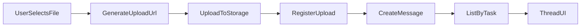

#### 1. Context & goal

- Build V2 of the message attachments feature to make uploads fully account-scoped, user-visible, and maintainable across the web app, Convex backend, and runtime.
- Hard constraints: multi-tenancy, strong auth checks, server-side validation, and auditability; preserve existing data and keep legacy `url` attachments readable.
- UX goal: users can upload, see progress, and view/download attachments in threads without broken links.

#### 2. Codebase research summary

- Inspected files:
  - [packages/backend/convex/messages.ts](packages/backend/convex/messages.ts) — upload URL, registerUpload, read-time URL resolution, attachment validation in `create`.
  - [packages/backend/convex/service/messages.ts](packages/backend/convex/service/messages.ts) — agent message attachment validation.
  - [packages/backend/convex/service/actions.ts](packages/backend/convex/service/actions.ts) — runtime service actions.
  - [packages/backend/convex/schema.ts](packages/backend/convex/schema.ts) — `messages.attachments` and `messageUploads` table.
  - [apps/web/src/components/tasks/MessageInput.tsx](apps/web/src/components/tasks/MessageInput.tsx) — file selection UI but no upload flow wiring.
  - [apps/web/src/components/tasks/MessageItem.tsx](apps/web/src/components/tasks/MessageItem.tsx) — message rendering without attachment display.
- Existing patterns to reuse:
  - `requireAccountMember()` for tenant checks, `logActivity()` for audit trail.
  - Convex `_storage` metadata via `ctx.db.system.get("_storage", storageId)`.
  - `messageUploads` table for account/task scoping.

#### 3. High-level design

- **Backend**: formalize a two-step upload flow with ownership tokens and TTL:
  - `messages.generateUploadUrl` returns `{ uploadUrl, uploadToken }`.
  - `messages.registerUpload` (or `messages.finalizeUpload`) validates `uploadToken`, `_storage` metadata, allowed MIME/size, then writes an account/task-scoped record.
- **Frontend**: wire `MessageInput` to call `generateUploadUrl` → POST file → `registerUpload` → `messages.create` with attachments.
- **Thread UI**: render attachments in `MessageItem`, using resolved URLs from `listByTask/get`.
- **Maintenance**: add cleanup for expired `messageUploads` and orphaned storage entries (scheduled mutation or admin task).

#### 4. File & module changes

- **Backend (existing files)**
  - [packages/backend/convex/messages.ts](packages/backend/convex/messages.ts)
    - Change `generateUploadUrl` to return `{ uploadUrl, uploadToken }`.
    - Add `finalizeUpload`/`registerUpload` logic to validate token + metadata + TTL.
    - Require `messageUploads` record before accepting `storageId` in `create`.
  - [packages/backend/convex/schema.ts](packages/backend/convex/schema.ts)
    - Extend `messageUploads` with `token`, `expiresAt`, `originalFileName`, `contentType`, `size`.
    - Add index on `token` for lookup and cleanup.
  - [packages/backend/convex/lib/validators.ts](packages/backend/convex/lib/validators.ts)
    - Add validator for upload token and attachment metadata; keep extension-based fallback for octet-stream.
  - [packages/backend/convex/service/messages.ts](packages/backend/convex/service/messages.ts)
    - Add agent-side `registerUploadFromAgent` to match token flow.
  - [packages/backend/convex/service/actions.ts](packages/backend/convex/service/actions.ts)
    - Add action to request `uploadUrl` and register agent upload with token.
- **Backend (new files)**
  - [packages/backend/convex/uploads_cleanup.ts](packages/backend/convex/uploads_cleanup.ts)
    - Scheduled mutation to remove expired `messageUploads` and optionally delete `_storage` files.
- **Frontend (existing files)**
  - [apps/web/src/components/tasks/MessageInput.tsx](apps/web/src/components/tasks/MessageInput.tsx)
    - Implement upload workflow: `generateUploadUrl` → POST file → `registerUpload` → pass `{ storageId, name }` in `messages.create`.
    - Add progress/errored states for individual files.
  - [apps/web/src/components/tasks/MessageItem.tsx](apps/web/src/components/tasks/MessageItem.tsx)
    - Render attachment chips/links; image preview for image MIME types; download for others.
- **Frontend (new files)**
  - [apps/web/src/components/tasks/MessageAttachments.tsx](apps/web/src/components/tasks/MessageAttachments.tsx)
    - Reusable attachment list component with preview/download behavior.

#### 5. Step-by-step tasks

1. **Schema updates**

- Extend `messageUploads` in [packages/backend/convex/schema.ts](packages/backend/convex/schema.ts) with `token`, `expiresAt`, `originalFileName`, `contentType`, `size` and index by `token`.

1. **Tokenized upload backend**

- Update `generateUploadUrl` in [packages/backend/convex/messages.ts](packages/backend/convex/messages.ts) to return `{ uploadUrl, uploadToken }`.
- Implement `registerUpload/finalizeUpload` to validate token + `_storage` metadata and store upload record with TTL.

1. **Attachment validation hardening**

- Update validators in [packages/backend/convex/lib/validators.ts](packages/backend/convex/lib/validators.ts) for tokens and metadata payloads.

1. **Runtime parity**

- Add `registerMessageUploadFromAgent` action in [packages/backend/convex/service/actions.ts](packages/backend/convex/service/actions.ts) and internal handler in [packages/backend/convex/service/messages.ts](packages/backend/convex/service/messages.ts).

1. **Cleanup job**

- Add `uploads_cleanup.ts` with a scheduled mutation to remove expired upload records and optionally delete storage files.

1. **Frontend wiring**

- Implement upload flow in [apps/web/src/components/tasks/MessageInput.tsx](apps/web/src/components/tasks/MessageInput.tsx) (progress + error display).
- Render attachments in [apps/web/src/components/tasks/MessageItem.tsx](apps/web/src/components/tasks/MessageItem.tsx) using a new `MessageAttachments` component.

1. **Tests & QA**

- Add backend tests for token validation, expiry, and invalid storage IDs.
- Add manual QA steps for upload success/fail and attachment rendering.

#### 6. Edge cases & risks

- Token expiry races: user uploads but registers after expiry → return explicit error and allow retry.
- Missing `contentType` from uploads: enforce client to send `Content-Type` or fail registration.
- Cleanup job risk: avoid deleting files referenced by messages; only delete `_storage` when no message uses the `storageId`.
- Large threads: attachment URL resolution should not cause excessive latency; consider limiting to recent messages or caching if needed.

#### 7. Testing strategy

- **Unit tests**
  - Token generation/validation, expiry logic, metadata validation.
- **Integration tests**
  - `generateUploadUrl` → upload → `registerUpload` → `messages.create` success.
  - Reject unregistered or expired upload.
- **Manual QA**
  - Upload image/pdf/docx/csv/json; confirm appears in thread with preview/download.
  - Upload with wrong MIME type; confirm error.
  - Upload then wait past TTL; confirm registration fails.

#### 8. Rollout / migration (if relevant)

- Backward compatible: keep `messages.attachments.url` optional and read-time URL resolution for legacy messages.
- Gradual rollout: feature flag upload tokens for a single account first.
- Observability: log token validation failures and cleanup counts.

#### 9. TODO checklist

- **Backend**
  - Extend `messageUploads` with `token`, `expiresAt`, `contentType`, `size`, `originalFileName`.
  - Update `generateUploadUrl` to return `{ uploadUrl, uploadToken }`.
  - Add `registerUpload/finalizeUpload` validation using token + storage metadata.
  - Add agent upload registration action + internal mutation.
  - Add cleanup job for expired uploads.
- **Frontend**
  - Wire upload flow in `MessageInput` (progress + errors).
  - Add `MessageAttachments` component and render in `MessageItem`.
- **Tests**
  - Unit tests for token validation and expiry.
  - Integration test for full upload-to-message flow.
- **Ops**
  - Add basic metrics/logging for upload failures and cleanup.
